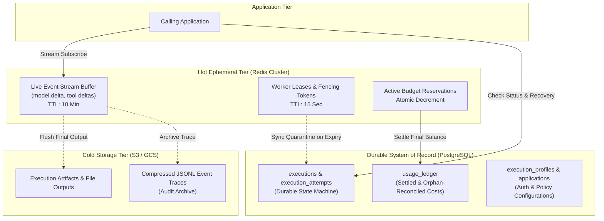

# Konsensus Arsitektural Final & Persetujuan Implementasi (Principal Final Sign-Off)

**Tanggal:** 20 September 2026  
**Peran:** Principal Systems Architect (Beyond FAANG)  
**Status:** **APPROVED FOR IMPLEMENTATION** (Konsensus Penuh dengan 3 Batasan Operasional Wajib)  
**Dokumen Rujukan:**
- [`ARCHITECTURE.md`](file:///d:/Ansha/architecture-description/ai-runtime-platform/ARCHITECTURE.md)
- [`PLAN.md`](file:///d:/Ansha/architecture-description/ai-runtime-platform/PLAN.md)
- [`ROADMAP.md`](file:///d:/Ansha/architecture-description/ai-runtime-platform/ROADMAP.md)
- *Tanggapan atas Principal Architectural Audit (Putaran 1 & Putaran 2)*

---

## 1. Executive Summary & Status Penutupan Diskursus

Dua putaran dialektika arsitektur antara auditor eksternal dan internal principal telah berhasil membedah, menguji, dan menyempurnakan blueprint AI Runtime Platform. Perdebatan tidak lagi berada pada tingkat filosofis, melainkan telah konvergen pada **arsitektur terdistribusi kelas produksi yang siap diimplementasikan**.

### Ringkasan Persetujuan:
1. **Diterima Penuh:** Arah *Managed Execution Envelope*, *Tiered Storage*, *Reserve–Execute–Settle*, serta *Phase 3.5 Reliability Gate*.
2. **Diterima Penuh:** Empat penyempurnaan dari internal principal:
   - Pemilihan default route (OpenRouter vs Direct) bersifat **Policy-Driven per Execution Profile**, bukan degradasi paksa OpenRouter menjadi sekadar fallback.
   - **Pemisahan Fencing:** Penolakan state/result mutasi dari worker usang dipisahkan dari **ingestion late-usage telemetry**.
   - **Pemisahan 4 Dimensi:** Penghentian sandbox lokal tidak boleh disamakan dengan selesainya mutasi eksternal atau penyelesaian finansial.
   - **Kalibrasi Matematis Gate:** Penyelarasan SLA failure detection dengan parameter lease/reaper.

Untuk memastikan tim engineering tidak mengalami ambiguitas atau menciptakan *performance bottleneck* saat menulis kode, dokumen ini menetapkan **3 Batasan Operasional Wajib (Non-Negotiable Boundaries)** sebelum sinkronisasi dokumen blueprint dimulai.

---

## 2. Tiga Batasan Operasional Wajib (The Non-Negotiables)

```
+---------------------------------------------------------------------------------------------------+
|                                3 NON-NEGOTIABLE OPERATIONAL BOUNDARIES                            |
+---------------------------------------------------------------------------------------------------+
| 1. HEARTBEAT DATA PATH: Heartbeat 5s WAJIB di Redis TTL; DILARANG query UPDATE per-detik ke PG.  |
| 2. LATE TELEMETRY CAP : Ingestion usage terlambat dibatasi Hard Window TTL (Maks 15-30 Menit).    |
| 3. DESTRUCTIVE TOOLS  : Tool stateful wajib expose `idempotency_key` & `status_query` endpoint.   |
+---------------------------------------------------------------------------------------------------+
```

### Batasan 1: Jalur Data Heartbeat & Lease (Anti-DB Row Lock Contention)
- **Aturan:** PostgreSQL adalah *System of Record*, **BUKAN distributed lock manager berkecepatan tinggi**.
- **Mekanisme:**
  - Pembaruan heartbeat per 5 detik dilakukan **murni di Redis** menggunakan key TTL 15 detik:
    ```text
    SET execution:{attempt_id}:lease {worker_id}:{fencing_token} EX 15
    ```
  - PostgreSQL **HANYA** mencatat dua transisi diskrit:
    1. Saat attempt pertama kali di-dispatch (`status = DISPATCHED`, catat `fencing_token = N`).
    2. Saat attempt resmi dinyatakan selesai (`COMPLETED` / `FAILED`) atau karantina (`ORPHAN_SUSPENDED`).
  - DILARANG mengeksekusi `UPDATE execution_attempts SET last_heartbeat = NOW()` ke PostgreSQL secara berkala. Melanggar aturan ini akan memicu *table bloat, autovacuum failure*, dan kehabisan connection pool pada skala ratusan worker konkuren.

---

### Batasan 2: Jendela Waktu Telemetry Ingestion Terlambat (Anti-Poisoning Ledger)
- **Aturan:** Bukti penggunaan token dari worker yang kehilangan ownership tetap di-ingest agar tidak ada *financial leakage*, **TETAPI tidak boleh diterima tanpa batas waktu**.
- **Mekanisme:**
  - Ditetapkan **Reconciliation Admission Window**: Maksimal **15 menit** setelah lease worker di Redis kedaluwarsa.
  - Laporan usage yang masuk dalam window 15 menit akan diverifikasi terhadap signature worker, dideduplikasi via `(attempt_id, provider_request_id)`, lalu dimasukkan ke `usage_ledger` dengan status `SETTLED_FROM_ORPHAN`.
  - Laporan usage yang tiba **melebihi 15 menit** otomatis ditolak dari ledger utama dan dialihkan ke antrean audit sekunder (`UNVERIFIABLE_STALE_USAGE`) untuk mencegah zombie node atau compromised container merusak pembukuan.

---

### Batasan 3: Kontrak Idempotensi untuk Stateful/Destructive Tools
- **Aturan:** Penghentian container lokal (`SIGKILL_CONFIRMED`) meninggalkan operasi eksternal pada status `UNKNOWN_IN_FLIGHT`.
- **Mekanisme:**
  - Semua tools/plugins yang melakukan operasi mutasi (misal: modifikasi database Scribe, push branch, kirim webhook) **WAJIB** menerima parameter `idempotency_key` yang digenerate oleh execution engine.
  - Tool runner wajib menyediakan interface query:
    ```typescript
    interface StatefulTool {
      execute(input: Json, idempotencyKey: string): Promise<ToolResult>;
      checkStatus(idempotencyKey: string): Promise<"COMMITTED" | "FAILED" | "UNKNOWN">;
    }
    ```
  - Jika execution terputus di tengah jalan, aplikasi pemilik workflow (Scribe/Farexlate) menggunakan `idempotency_key` tersebut untuk mengecek status mutasi sebelum memutuskan apakah aman untuk melakukan retry bisnis.

---

## 3. Spesifikasi Arsitektur Target (Final Blueprint)

### A. Tiered Storage Mapping



| Tier Storage | Tanggung Jawab Data | Karakteristik I/O | Kebijakan Retensi |
| :--- | :--- | :--- | :--- |
| **PostgreSQL** | `applications`, `execution_profiles`, `executions`, `execution_attempts`, `usage_ledger`, durable cancel intents. | Transaksional ACID, low-write/high-value, zero per-second polling. | Permanen (Audit SoR). |
| **Redis** | Event deltas (`model.delta`), SSE sequence buffer, distributed worker lease, budget reservation counters. | In-memory ultra-low latency, ephemeral, lock-free concurrency. | Ring buffer (TTL 10m) / Lease (TTL 15s). |
| **Object Storage** | Artifact output, workspace files, raw prompt bundles, compressed full execution transcripts. | High-throughput blob write, immutable. | Sesuai policy lifecycle organisasi (30–90 hari). |

---

### B. Matriks Status Eksekusi 4-Dimensi

Platform menolak representasi status tunggal yang menyamarkan kegagalan terdistribusi. Setiap attempt dicatat dalam 4 dimensi ortogonal:

```text
Attempt Record:
  +-- 1. Authority (Ownership)  : [ACTIVE | LOST | FENCED]
  +-- 2. Local Compute Sandbox  : [STARTING | RUNNING | TERMINATING | SIGKILL_CONFIRMED]
  +-- 3. External Operations    : [NONE | IN_FLIGHT | COMMITTED | FAILED | UNKNOWN_IN_FLIGHT]
  +-- 4. Financial Accounting   : [RESERVED | PENDING_RECONCILIATION | SETTLED | OVERAGE_SETTLED]
```

#### Aturan Transisi:
1. Client hanya menerima status terminal tingkat tinggi (`COMPLETED`, `FAILED`, `CANCELLED`, `TIMED_OUT`) jika:
   - **Sukses:** `Authority == ACTIVE` AND `External Operations == COMMITTED` AND `Financial Accounting == SETTLED`.
   - **Gagal Terisolasi:** `Local Compute Sandbox == SIGKILL_CONFIRMED` AND `External Operations in [NONE, FAILED]`.
2. Jika attempt mengalami timeout/crash saat `External Operations == IN_FLIGHT`, status publik dilaporkan sebagai:
   `FAILED_WITH_EXTERNAL_AMBIGUITY`. 
   Aplikasi bisnis menerima payload berisi `idempotency_key` dari tool yang sedang berjalan untuk rekonsiliasi manual/programatis.

---

### C. Protokol Finansial: Reserve–Execute–Settle

```text
[POST /v1/executions]
        |
        v
1. PRE-FLIGHT RESERVATION:
   - Calculate Envelope: Ceiling = (Profile.MaxInputTokens + Profile.MaxOutputTokens) * UnitRate
   - Atomic Check & Hold: Redis.DECRBY(TenantBudgetPool, Ceiling)
   - If balance < 0: Return HTTP 402/429 (Budget Exhausted)
        |
        v
2. IN-FLIGHT BOUNDARY:
   - Pass hard limit to provider: `max_tokens = Profile.MaxOutputTokens`
   - Worker sandbox enforces max turn iteration count (e.g. max 15 steps)
        |
        v
3. POST-FLIGHT SETTLEMENT:
   - Capture provider actual usage tokens & reported cost.
   - Settle: ActualSpend = (InputTokens * Rate) + (OutputTokens * Rate)
   - Atomic Release: Redis.INCRBY(TenantBudgetPool, Ceiling - ActualSpend)
   - Write immutable audit row to PostgreSQL `usage_ledger`: status = `SETTLED`
```

---

## 4. Kalibrasi Phase 3.5: Core Reliability & Security Gate

Phase 3.5 adalah **Hard Blocker** sebelum workload Scribe, Farexlate, atau RAG dimigrasikan pada Phase 4. Kriteria kelulusan ditetapkan secara deterministik:

| Skenario Uji (Chaos & Security) | Injeksi Kegagalan & Parameter | Indikator Keberhasilan (Exit Criteria) |
| :--- | :--- | :--- |
| **Worker Chaos Test** | `SIGKILL` mendadak pada worker container saat turn ke-3 tool execution berjalan ($t_0$).<br>Parameter: Heartbeat = 5s, Lease TTL = 15s, Reaper = 5s. | Reconciler menandai attempt `ORPHAN_SUSPENDED` dalam waktu $t \le 20$ detik dari $t_0$. Worker pengganti membawa fencing token baru; worker lama (jika hidup lagi) ditolak saat mencoba commit state. |
| **SSE Reconnect & Window Test** | Putus koneksi klien di tengah streaming model delta. Sambungkan kembali setelah 15 detik menggunakan header `Last-Event-ID`. | Klien menerima sisa delta dari Redis hot buffer tanpa membuat execution attempt baru. Jika reconnect setelah TTL buffer habis (10 menit), server merespons `HTTP 410 Gone` dengan snapshot URL SoR yang otoritatif. |
| **Budget Concurrency Race** | 50 request konkuren dikirim serentak pada tenant dengan sisa kuota hanya cukup untuk 3 request. | Tepat 3 request lolos (`HTTP 200/202`); 47 request ditolak pada fase admission (`HTTP 429`). Tidak terjadi *over-commit* kuota melebihi sisa pool. |
| **Late Usage Ingestion Test** | Worker orphan mengirimkan metrik token 5 menit setelah lease kedaluwarsa dan attempt baru di-dispatch. | State eksekusi tetap milik attempt baru. Laporan token attempt lama masuk ke `usage_ledger` sebagai `SETTLED_FROM_ORPHAN`. Audit finansial akurat 100%. |
| **Sandbox Security & Metadata Isolation** | Agent mengeksekusi payload berbahaya yang mencoba membaca `/proc/1/environ`, host socket, atau melakukan HTTP request ke `http://169.254.169.254`. | Akses filesystem host ditolak (`Permission Denied`). Egress traffic ke link-local dan private control-plane CIDR di-drop di level network namespace. |

---

## 5. Rencana Aksi Sinkronisasi Dokumen Sumber

Konsensus telah final. Langkah eksekusi berikutnya adalah memperbarui ketiga dokumen arsitektur:

1. **[`ARCHITECTURE.md`](file:///d:/Ansha/architecture-description/ai-runtime-platform/ARCHITECTURE.md):**
   - Perbarui diagram arsitektur ke *Tiered Storage* (PostgreSQL SoR + Redis Buffer + Object Store).
   - Masukkan definisi *Managed Execution Envelope* dan state machine 4-dimensi.
   - Cantumkan aturan *Fencing Token*, *Late Usage Ingestion Window*, dan *Destructive Tool Idempotency*.
2. **[`PLAN.md`](file:///d:/Ansha/architecture-description/ai-runtime-platform/PLAN.md):**
   - Tambahkan pembuktian Dual-Adapter (Direct Anthropic + OpenRouter) pada Phase 2.
   - Sisipkan **Phase 3.5: Core Reliability & Security Gate** dengan 5 skenario kegagalan wajib sebelum Phase 4.
   - Masukkan kontrak *Stream Resumption* dan skema *Reserve–Execute–Settle* ke Phase 0 & 1.
3. **[`ROADMAP.md`](file:///d:/Ansha/architecture-description/ai-runtime-platform/ROADMAP.md):**
   - Perbarui Milestone 2 menjadi *Direct & Aggregator Gateway MVP*.
   - Sisipkan Milestone 3.5 sebagai *Production Readiness Gate*.
   - Perbarui Milestone 5 (Codex SDK / Responses Engine) dan selaraskan metriks keberhasilan dengan pengujian terkalibrasi.
