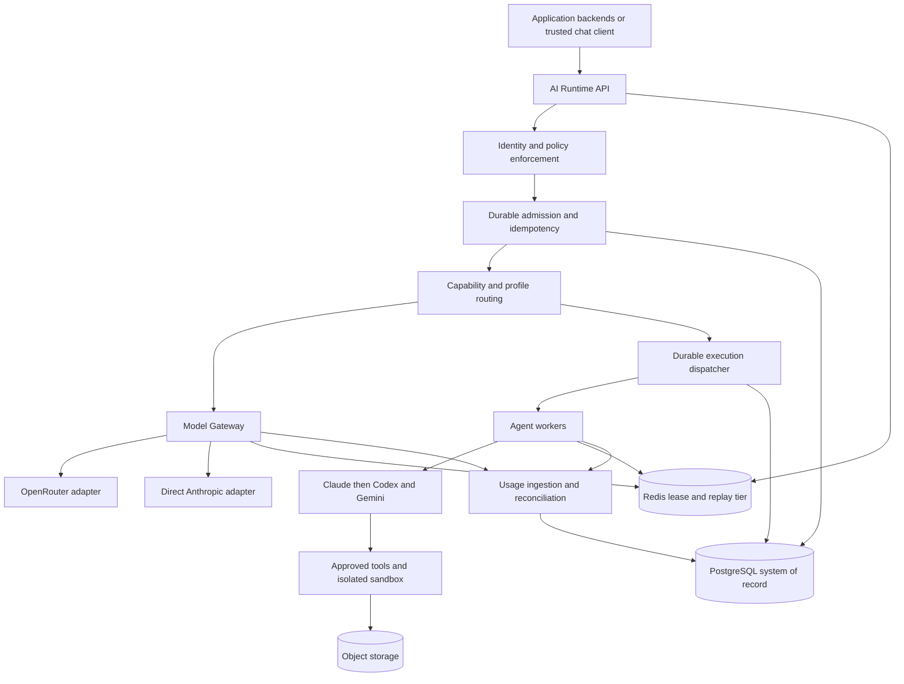

# AI Runtime Platform — Architecture

**Baseline:** 0.2 · 20 September 2026 · **Jenis:** rancangan, bukan implementasi yang telah diuji.

Dokumen ini menjabarkan kebutuhan produk dan keputusan aktif pada [ADR](../adr/README.md). Pemetaan topik, klarifikasi operasional, spesifikasi, dan gate tersedia di [decision traceability](../reviews/RECONCILIATION.md); riwayat review bukan dependency implementasi. Istilah MUST/WAJIB berarti requirement baseline, bukan bukti bahwa requirement sudah terpenuhi.

## 1. Tujuan dan batas produk

> Aplikasi memiliki business job, workflow, instruksi domain, dan penerimaan hasil. Platform memiliki AI execution, kebijakan eksekusi, serta audit penggunaan.

Platform melayani direct chat, generation terstruktur, dan agent dengan tools/plugins melalui kontrak bersama. `process_id`, `step_id`, dan `conversation_id` bersifat opsional; tidak ada business job palsu untuk direct chat. Setiap request yang diterima tetap mempunyai identitas aplikasi terautentikasi dan `execution_id` untuk audit.

Agnostic berarti lifecycle dan kontrak publik tidak terikat vendor. Bukan berarti semua runtime identik, semua model memiliki kemampuan sama, atau sesi bisa dipindah lintas runtime tanpa evaluasi. `Provider`, `model`, `runtime`, `credential_binding`, dan `harness_version` adalah konsep berbeda.

## 2. Konteks dan komponen

Gambar adalah logical view, bukan izin aplikasi mengakses storage atau provider langsung. API/worker services melakukan akses sesuai trust boundary. Lihat [katalog diagram](../diagrams/README.md) untuk konteks, deployment, flow, state machine, dan ERD lengkap.

| Komponen | Tanggung jawab | Bukan tanggung jawab |
| --- | --- | --- |
| AI Runtime API | Auth, validasi kontrak, status, cancel, stream, artifact access | Domain workflow aplikasi |
| Policy/profile service | Profile immutable, binding model/runtime/tools, batas penggunaan | Mengubah instruksi domain tanpa versi/persetujuan owner |
| Admission/accounting | Idempotency, reservasi durable, settlement, audit | Menjamin tagihan tepat pada nominal dolar tertentu |
| Model Gateway | Direct inference, stream normalisasi, routing, usage capture | Agent loop yang tidak diminta |
| Dispatcher/worker supervisor | Durable assignment, fenced authority, recovery, sandbox lifecycle | Retry bisnis atau menganggap lease hilang berarti side effect batal |
| Runtime adapter | Terjemahan lifecycle dan capability runtime | Portabilitas perilaku tanpa acceptance test |
| Tool broker | Otorisasi operasi, idempotency, status inquiry | Publikasi bisnis tanpa mandat aplikasi |
| Event relay | Fan-out dan replay berretensi terbatas | Sumber status/biaya yang otoritatif |

## 3. Managed Execution Envelope

Envelope mempunyai common context, capability, typed input, execution profile, batas yang diizinkan, dan correlation ID. Cognitive harness (prompt, skill, template, domain tools) dimiliki app/team. Platform menyimpan atau menjalankannya sebagai paket immutable yang disetujui, bukan mengambil alih domain.

Profile memisahkan runtime engine dari model policy dan provider binding. Contoh `scribe-doc-v2` dapat menunjuk Claude runtime dengan paket Scribe tertentu; profile `chat-default` menunjuk gateway tanpa plugin dan tanpa sandbox agent. Caller dapat menurunkan batas yang diizinkan, tidak menaikkan izin lewat body request.

Kontrak publik lengkap berada di [API](../contracts/API.md); profile dan adapter di [PROFILES-ADAPTERS](../contracts/PROFILES-ADAPTERS.md). Endpoint facade `POST /v1/chat` dan `POST /v1/generate` memakai pipeline admission/audit yang sama dengan `POST /v1/executions`; direct calls tidak wajib antre di agent queue.

## 4. Boundary ownership

Business retries, review, validation, retrieval ACL, publication, glossary, dan domain state tetap di aplikasi. Platform dapat melakukan bounded infrastructure retry yang dinyatakan profile dan aman terhadap side effect. Satu retry menciptakan attempt baru; tidak mengubah business job menjadi sukses.

Direct-chat UI melalui backend/BFF secara default. Akses client langsung hanya dengan token delegated berumur pendek dan scope terbatas; provider key maupun service credential tidak boleh masuk browser. `application_id`/tenant tidak dipercaya dari request body. Detail actor, trust boundary, serta integrasi platform lain ada di [BOUNDARIES](BOUNDARIES.md).

## 5. Data dan authority

| Tier | Data | Aturan baseline |
| --- | --- | --- |
| PostgreSQL | Executions, attempts, generation, control events, cancel intents, profiles, reservations, usage observations/ledger, outbox | Durable correctness authority; transaksi diskrit, bukan satu row per token atau heartbeat periodik |
| Redis | Lease TTL, coordination epoch projection, replay stream, fan-out, rate windows, cache budget | Data panas; cache tidak boleh menjadi satu-satunya sumber kebenaran financial reservation |
| Object storage | Input/output artifacts, manifest, checkpoint, transcript jika policy mengizinkan | Scoped access, checksum, retention, cleanup, tidak terbuka lintas tenant |

**Keputusan accounting:** reservasi dan settlement finansial otoritatif berada dalam transaksi PostgreSQL; Redis menjadi projection/fast rejection, bukan Redis-decrement lalu ledger-write yang terpisah. Ini memperjelas atomicity dan recovery, bukan memindahkan heartbeat ke database. Lihat [ADR-0007](../adr/0007-durable-accounting.md).

Final result dan manifest tidak dibentuk hanya dari replay buffer; worker/gateway memfinalisasi output secara independen. Hilangnya Redis boleh menghilangkan delta di luar jaminan replay, tetapi tidak boleh menghapus keputusan admission, cancel, atau ledger yang sudah committed.

## 6. Lifecycle yang tidak mencampur fakta

Public execution status: `ACCEPTED`, `QUEUED`, `RUNNING`, `CANCEL_REQUESTED`, `RECONCILING`, `COMPLETED`, `FAILED`, `CANCELLED`, `TIMED_OUT`. Detail reason/result revision terpisah. Attempt mempertahankan empat dimensi: authority, local compute, external operations, accounting.

`COMPLETED` berarti hasil execution sudah difinalisasi sesuai kontrak platform; bukan domain acceptance dan bukan billing selesai. Kombinasi `COMPLETED + external NONE + accounting PENDING_RECONCILIATION` valid. Direct inference memakai compute `NOT_APPLICABLE`; kegagalan normal tidak membutuhkan SIGKILL. Setelah finalisasi, authority dapat `RELEASED` tanpa mengubah hasil terminal.

State model, precondition, race cancel-versus-complete, dan kombinasi valid ada di [EXECUTION-LIFECYCLE](../contracts/EXECUTION-LIFECYCLE.md). Mutasi eksternal yang ambigu ditandai `FAILED` dengan reason `EXTERNAL_OUTCOME_UNKNOWN`, bukan dianggap tidak pernah terjadi.

## 7. Worker lease dan recovery

Durable assignment mengalokasikan generation monotonic di PostgreSQL. Supervisor menerbitkan lease Redis untuk assignment itu; worker tidak bebas membuat ulang lease. Renewal atomik memeriksa existence, owner, generation, dan coordination epoch; key hilang atau mismatch menyebabkan renewal gagal, bukan `SET` baru.

Heartbeat kandidat 5 detik, TTL 15 detik, dan reconciler interval 5 detik mengikuti keputusan [ADR-0005](../adr/0005-leases-fencing.md) serta [parameter register](../operations/SLO-CAPACITY.md); nilainya bukan hasil pengukuran produksi. Tidak ada periodic `UPDATE last_heartbeat` ke PostgreSQL. Commit status/result dilakukan control plane dengan pemeriksaan assignment/generation dan CAS terhadap state; late usage melewati jalur evidence terpisah.

Lease expiry adalah failure signal. Authority final ditentukan oleh durable state transition, bukan klaim bahwa dua datastore diperbarui atomik. Quarantine merevokasi generation sebelum reassignment; worker lama ditolak setelah fence durable. TTL loss, Redis failover, network partition, dan race finalization dibahas di [OWNERSHIP-RECOVERY](../reliability/OWNERSHIP-RECOVERY.md).

## 8. Pengendalian biaya dan audit

Setiap accepted execution mempunyai reservation atau keputusan admission bebas-biaya yang tercatat. Budget memperhitungkan posted charge serta outstanding hold semua request concurrent. Penolakan tidak mengurangi balance/hold. Settlement dan adjustment idempotent; pelaporan usage tidak memerlukan active ownership.

Bedakan observed tokens, estimated cost, provider-reported cost, measurement completeness, verification, dan settlement. `unknown` bukan nol. Failed/retried calls tetap termasuk biaya; summary parent tidak dijumlahkan lagi dengan child invocation yang sama.

Late-worker window kandidat 15 menit mengatur jalur verifikasi otomatis, bukan batas kebenaran biaya. Evidence lebih tua dikarantina, dapat diverifikasi dan menghasilkan adjustment ledger. Detail envelope multi-turn, partial settlement, reservation release, source precedence, dan crash matrix ada di [ACCOUNTING](../data/ACCOUNTING.md).

## 9. Streaming, tools, artifact, dan sesi

SSE menggunakan cursor opaque dengan execution/attempt/stream epoch. Replay dalam window 10 menit kandidat dan byte cap yang dinyatakan; cursor hilang memberi `410 STREAM_RESUME_EXPIRED` plus authorized snapshot endpoint. Reconnect tidak membuat inference baru. Durable lifecycle events dipisah dari live deltas.

Stateful tools membutuhkan stable logical-operation key, request digest, receiver-supported idempotency, dan status lookup. Tool mutasi tanpa kontrak tersebut tidak diizinkan pada autonomous retry profiles; side effect dapat dikembalikan ke aplikasi. MCP opsional sebagai protocol adapter, bukan pengganti authorization atau sandbox.

Business conversation dimiliki aplikasi. Runtime session opsional, tenant-scoped, single-writer, terikat runtime/profile version; cross-runtime resume tidak dijanjikan. Artifact memakai immutable manifests dan commit result yang fenced. Lihat [EVENTS](../contracts/EVENTS-STREAMING.md), [TOOLS](../contracts/TOOLS-PLUGINS.md), dan [ARTIFACTS](../contracts/ARTIFACTS-SESSIONS.md).

## 10. Security dan deployment

Mulai dari modular control plane, gateway process/pool, isolated agent worker pool, PostgreSQL, Redis, object store, serta secret store. Runtime yang mengeksekusi kode tidak dijalankan di proses API. Kebutuhan container sandbox/gVisor/microVM diputuskan melalui threat model; direktori per job bukan sandbox.

Gunakan per-app identity, least privilege, approved package digests, egress allowlist, no host socket/mount secrets, no metadata service access, scoped provider credentials, resource quotas, dan redacted logs. Pools interactive, batch, agent dipisahkan untuk admission/concurrency. Jumlah replica, HA Redis, cloud, RPO/RTO, retention, dan SLO produksi belum ditetapkan oleh sumber; tracked decision diperlukan.

## 11. Invariant baseline

| ID | Invariant | Spesifikasi utama |
| --- | --- | --- |
| INV-01 | Workflow/domain acceptance tetap di aplikasi | BOUNDARIES |
| INV-02 | Chat tidak membutuhkan business job/plugin | API |
| INV-03 | Identity dan policy ditegakkan server-side | SECURITY |
| INV-04 | Satu logical submission, attempts eksplisit | API, LIFECYCLE |
| INV-05 | Worker lama tidak memenangkan state setelah fence | OWNERSHIP-RECOVERY |
| INV-06 | Local stop tidak membuktikan external outcome | LIFECYCLE, TOOLS |
| INV-07 | Rejected admission tidak mengubah budget | ACCOUNTING |
| INV-08 | Unknown usage tidak menjadi zero; evidence tidak double-counted | ACCOUNTING |
| INV-09 | Result completion terpisah dari settlement | LIFECYCLE |
| INV-10 | SSE replay terbatas dan tidak membuat attempt baru | EVENTS |
| INV-11 | Secret/artifact/session tidak bocor antar-app/tenant | SECURITY |
| INV-12 | Production migration menunggu gate evidence | ACCEPTANCE |

## 12. Evolusi dan status

[PLAN.md](../PLAN.md) mendefinisikan work packages; [ROADMAP.md](../ROADMAP.md) milestones dan dependency. Phase 2 membuktikan OpenRouter dan Direct Anthropic pada common capability. OpenRouter tetap boleh primary per profile. Claude adalah runtime pertama; Codex dan Gemini menyusul dengan compatibility tests.

Semua implementation phases **belum dikerjakan** dalam perubahan dokumentasi ini. [ADR index](../adr/README.md), [open decisions](../decisions/OPEN-QUESTIONS.md), [test gates](../testing/ACCEPTANCE.md), dan [validation record](../reviews/VALIDATION.md) membedakan keputusan desain, pertanyaan terbuka, serta bukti yang benar-benar tersedia.
