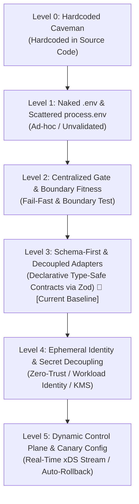
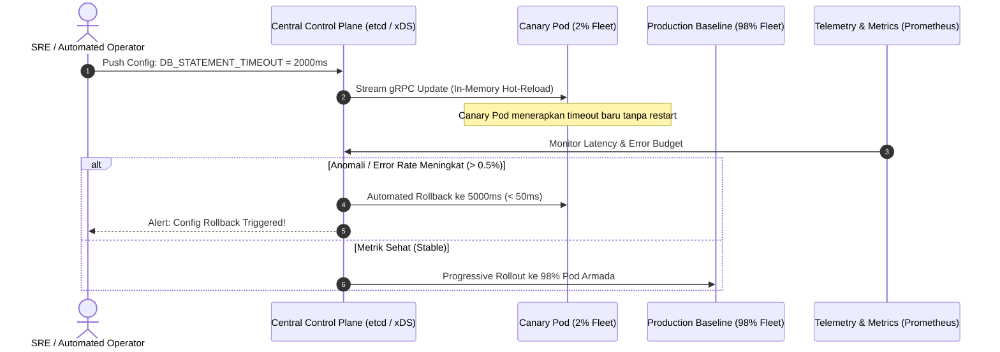

# Configuration & Environment Maturity Model: From Primitive to Beyond FAANG

Dokumen ini mendefinisikan taksonomi formal dan model maturitas arsitektur untuk manajemen konfigurasi (_environment variables_, _runtime parameters_, dan _secrets_) dalam rekayasa perangkat lunak modern. Model ini disusun berdasarkan analisis _first principles_, _system thinking_, _operational blast radius_, dan _failure mode analysis_—mulai dari pendekatan amatir hingga standar infrastruktur _mission-critical hyperscale_ (Beyond FAANG).

---

## 1. Executive Summary & First Principles

Konfigurasi aplikasi sering kali direduksi menjadi sekadar _"membaca file `.env`"_. Reduksi ini adalah kesalahan fatal. Dalam arsitektur perangkat lunak skala tinggi, konfigurasi berada pada irisan kritis antara:

1. **Coupling & Portability:** Seberapa mudah aplikasi dipindahkan antar-lingkungan (_local_, _CI_, _staging_, _multi-region production_) tanpa mengubah artefak biner (_Twelve-Factor App rule III_).
2. **Security & Zero-Trust:** Bagaimana sistem mencegah eksfiltrasi kredensial melalui _memory dump_, pewarisan proses (_child process inheritance_), log agregator, atau inspeksi `/proc/$PID/environ`.
3. **Availability & MTTR (Mean Time to Recovery):** Bagaimana sistem mengubah parameter operasional (_timeout_, _circuit breaker_, _rate limit_) saat terjadi insiden tanpa memicu _cascading failure_ akibat _rolling restart_.

### Taksonomi 6 Tingkat Maturitas



---

## 2. Matriks Komparasi Kemampuan (Maturity Matrix)

| Dimensi Arsitektur     | Level 0: Primitive | Level 1: Naked .env | Level 2: Centralized Gate   | Level 3: Schema-First Contract (Repo ini) | Level 4: Ephemeral Secrets    | Level 5: Dynamic Control Plane |
| :--------------------- | :----------------- | :------------------ | :-------------------------- | :---------------------------------------- | :---------------------------- | :----------------------------- |
| **Media Konfigurasi**  | Inline Code        | File `.env` lokal   | Single Gateway Module       | Typed Schema (Zod/TypeBox)                | KMS / Secret Manager / IAM    | Push-stream (gRPC/xDS)         |
| **Penyimpanan Secret** | Plain text di VCS  | Plain text di disk  | Plain text di disk / OS env | Environment / File adapter                | Ephemeral RAM / SPIFFE Token  | Dynamic In-Memory Store        |
| **Waktu Validasi**     | Compile time       | Runtime (on-demand) | Process Startup (Fail-fast) | Process Startup & Build CI                | Process Startup & Token Lease | Continuous Validation          |
| **Siklus Perubahan**   | Rebuild + Deploy   | Process Restart     | Process Restart             | Process Restart                           | Dynamic Lease Renewal         | Zero-Downtime Hot-Reload       |
| **Proteksi Leaks**     | Nol (Bocor di Git) | Sangat Rendah       | Sedang (Modular gate)       | Sedang (Tersanitasi)                      | Tinggi (RAM-only tmpfs)       | Sangat Tinggi (No disk/env)    |
| **Canary Rollout**     | Tidak ada          | Tidak ada           | Tidak ada                   | Tidak ada                                 | Bertahap per cluster          | Canary per request/pod (%)     |
| **Target Skala**       | Toy Project        | Startup Awal        | Mid/Enterprise Monorepo     | Multi-team Service Fleet                  | Cloud-Native Enterprise       | Planetary / Hyperscale         |

---

## 3. Level 0: The Hardcoded Caveman (Primitive Anti-Pattern)

Pendekatan paling dasar di mana seluruh parameter operasional dan kredensial sensitif ditulis langsung ke dalam _source code_.

```typescript
// ANTI-PATTERN: Hardcoded parameters & credentials
export const dbClient = new DatabaseClient({
  host: '10.0.4.12',
  port: 5432,
  user: 'admin',
  password: 'SuperSecretPassword123!',
  timeoutMs: 5000,
});
```

### Karakteristik & Kegagalan Sistemik

- **Git History Poisoning:** Sekali _commit_ masuk ke VCS, kredensial tersimpan selamanya dalam riwayat Git dan dapat dieksfiltrasi meskipun file telah dihapus di _commit_ berikutnya.
- **Violation of Hermetic Builds:** Perubahan nilai konfigurasi (misal: menaikkan _timeout_ dari 5 detik ke 10 detik) mewajibkan kompilasi ulang, _image build_, dan _full redeployment_.
- **Zero Multi-Tenancy:** Mustahil menjalankan kode yang sama di mesin lokal developer dan server testing secara berdampingan tanpa mengubah baris kode.

---

## 4. Level 1: Naked `.env` & Scattered `process.env` (Junior / Naive 12-Factor)

Developer membaca prinsip _12-Factor App_ secara dangkal, menginstal pustaka `dotenv`, membuat file `.env`, lalu mengakses global object `process.env` di sembarang file.

```typescript
// controllers/payment.controller.ts
export async function handlePayment(req: Request, res: Response) {
  // Rentan typo, evaluasi string tak terduga, dan tanpa validasi
  const timeout = process.env.PAYMENT_TIMEOUT || 3000;
  const isDebug = process.env.DEBUG_MODE === 'true';
  const apiKey = process.env.STRIPE_SECRET_KEY; // Bisa bernilai undefined tanpa disadari

  await callStripe(apiKey, { timeout: Number(timeout) });
}
```

### Karakteristik & Kegagalan Sistemik

1. **Silent Runtime Explosion:** Jika developer salah mengetik nama variabel (misal `STRIPE_KEY` alih-alih `STRIPE_SECRET_KEY`), aplikasi tetap menyala normal. Crash baru terjadi di _production_ jam 2 pagi saat fungsi pembayaran dipanggil user.
2. **Type Coercion Traps:** Semua variabel dari environment bertipe `string`. Pernyataan `if (process.env.FEATURE_ENABLED)` akan selalu bernilai `true` meskipun diisi string `"false"`, karena non-empty string adalah _truthy_ di JavaScript.
3. **Global State Pollution & High Coupling:** Ratusan file aplikasi terikat langsung pada environment global. Pengujian unit (_unit testing_) menjadi kotor karena harus memanipulasi `process.env` sebelum dan sesudah setiap test case (`beforeEach`/`afterEach`).

---

## 5. Level 2: Centralized Gate & Boundary Fitness Functions (Disciplined Mid-Tier)

> **Status Repositori Ini:** Implementasi sistem saat ini berada di Level 2 yang sangat matang dan disiplin.

Pendekatan ini mengisolasi pemuatan environment ke dalam satu modul pintu gerbang (_single authority gate_), memvalidasi tipe data secara imperatif saat _startup_, dan memaksakan aturan arsitektur melalui pengujian otomatis.

```
[ .env File / OS Environment ]
             │
             ▼
┌─────────────────────────────────────────┐
│     config/environment.mjs              │
│  - loadDotEnv() via Node.js native      │
│  - required(), integer(), boolean()     │
│  - Projections: API vs Web              │
└─────────────────────────────────────────┘
      │                           │
      ▼                           ▼
[ apps/api ]                 [ apps/web ]
(Database, Seeds, Ports)     (Public Origin, BFF Caps)
```

### Implementasi pada Platform Ini

1. **Single Entry Point:** File `config/environment.mjs` menjadi satu-satunya otoritas pembacaan variabel.
2. **Fail-Fast Startup:** Fungsi `required()`, `integer()`, dan `boolean()` melempar exception saat aplikasi _boot_, menolak proses berjalan jika ada variabel yang salah format.
3. **Architectural Fitness Function:** File `scripts/test/environment-boundary.test.mjs` memeriksa seluruh _codebase_ menggunakan regex `/process\.env\.[A-Z_]/` untuk memastikan tidak ada pemanggilan `process.env` liar di luar modul konfigurasi.
4. **Least Privilege Projections:** Pemisahan antara `loadEnvironment()` (untuk API backend dan database) serta `loadWebEnvironment()` (khusus web frontend/BFF tanpa kredensial database).

### Limitasi Level 2

- **Static Process Lifecycle:** Perubahan parameter operasional wajib membunuh dan me-restart proses Node.js.
- **Hand-Rolled Parser:** Validasi ditulis manual secara imperatif, membutuhkan banyak boilerplate dan rentan terhadap keterbatasan parsing struktur bersarang (_nested object_ atau array kompleks).
- **Monolithic Monorepo Coupling:** File `.env` di root memuat konfigurasi database backend dan frontend sekaligus, mencampur boundary keamanan deployment.

---

## 6. Level 3: Schema-First Contracts & Decoupled Adapters (Standard Modern Enterprise)

Tingkat di mana konfigurasi diperlakukan sebagai **Software Contract** formal menggunakan schema compiler deklaratif (seperti **Zod**, **TypeBox**, atau **CUE**), dipadukan dengan arsitektur heksagonal (_ports and adapters_).

```typescript
// config/schema.ts
import { z } from 'zod';

export const RuntimeConfigSchema = z.object({
  NODE_ENV: z
    .enum(['development', 'test', 'production'])
    .default('development'),
  PORT: z.coerce.number().int().min(1024).max(65535),
  DATABASE: z.object({
    HOST: z.string().min(1),
    PORT: z.coerce.number().int().default(5432),
    NAME: z.string().min(1),
    USER: z.string().min(1),
    PASSWORD: z.string().min(16), // Menegakkan standar entropi password
    POOL_MAX: z.coerce.number().int().min(1).max(50).default(10),
  }),
  CORS_ORIGINS: z
    .string()
    .transform((val) => val.split(',').map((s) => s.trim())),
});

export type RuntimeConfig = z.infer<typeof RuntimeConfigSchema>;
```

### Abstraksi Port and Adapter

```typescript
// ports/config-provider.port.ts
export interface ConfigProvider {
  load(): Promise<RuntimeConfig>;
}

// adapters/env-file.adapter.ts (Untuk Local M0/M1)
export class EnvFileConfigAdapter implements ConfigProvider { ... }

// adapters/k8s-configmap.adapter.ts (Untuk Staging/Production)
export class KubernetesConfigAdapter implements ConfigProvider { ... }
```

### Keunggulan Level 3

- **Type-Inference Otomatis:** Menghapus kebutuhan menulis tipe TypeScript secara manual (`environment.d.mts`). Tipe data selalu sinkron dengan aturan validasi secara otomatis.
- **Transformasi & Sanitasi Data:** Mendukung konversi data deklaratif (misal: memecah string koma menjadi array yang terfilter).
- **Detailed Diagnostics:** Memberikan laporan error terstruktur menyeluruh saat _boot_ (bukan hanya satu error yang melempar exception pertama kali, melainkan seluruh daftar variabel yang bermasalah sekaligus).

---

## 7. Level 4: Ephemeral Identity & Secret Decoupling (Production Cloud-Native / FAANG)

Pada tingkat ini, paradigma penyimpanan kredensial mengalami pemisahan fundamental: **Non-sensitive Config** dipisahkan secara fisik dan logis dari **Sensitive Secrets**.

```
                         ┌──────────────────────────────────────────────┐
                         │              Application Pod                 │
                         │                                              │
K8s ConfigMap ──────────►│  Non-Sensitive: Port, Timeout, Log Level    │
                         │                                              │
Cloud IAM / OIDC ───────►│  Workload Identity (Short-Lived 15m Token)   │
                         │                                              │
HashiCorp Vault ────────►│  Mounted tmpfs (/dev/shm) RAM-Only Secret    │
                         └──────────────────────────────────────────────┘
```

### Mekanisme Utama

1. **Workload Identity Federation (Zero Static Credentials):**
   - Aplikasi tidak lagi memiliki password database statis atau static API keys.
   - Container menggunakan identitas kriptografis bawaan (misal: Kubernetes Service Account Token via _OIDC Federation_ ke AWS IAM / GCP Workload Identity).
   - Aplikasi meminta token akses jangka pendek (_ephemeral token_, umur 15-60 menit) langsung ke penyedia _cloud_ atau _identity provider_.
2. **Mutual TLS (mTLS) & SPIFFE/SPIRE:**
   - Komunikasi antar-layanan diautentikasi lewat sertifikat X.509 yang dirotasi otomatis setiap beberapa jam, bukan menggunakan _shared API tokens_.
3. **RAM-Only Secret Mounting (Anti-Memory Leak):**
   - Secret tidak pernah ditulis ke disk atau diekspos ke environment variable OS (`process.env`).
   - Mengapa? Environment variable di OS Linux dapat diinspeksi melalui `/proc/$PID/environ`, terwariskan ke seluruh _child process_, dan rentan bocor saat terjadi _core dump_ atau pelaporan crash otomatis (_crash reporters_).
   - Secret di-injeksi oleh agen (misal: _Vault Sidecar Agent_) ke dalam shared-memory virtual (`tmpfs` di `/dev/shm/secrets`), yang hanya ada di RAM dan terhapus saat container mati.

---

## 8. Level 5: Dynamic Reconfiguration & Canary Control Plane (Beyond FAANG / Hyperscale)

Level tertinggi yang dioperasikan pada sistem dengan puluhan hingga ratusan ribu node (seperti **Netflix Archaius**, **Envoy xDS Control Plane**, **Uber Flip**, dan **Google Borg Config**).

Pada level ini, sistem **tidak boleh di-restart** hanya untuk mengubah nilai konfigurasi operasional.



### Mekanisme Utama

1. **Dual-Plane Architecture:**
   - **Bootstrap Plane (Statis):** Parameter minimal agar proses dapat hidup dan terhubung ke jaringan (Port bind, Identity Token, Control Plane URL).
   - **Dynamic Runtime Plane (Dinamis):** Nilai-nilai operasional (_circuit breaker thresholds_, _retry policies_, _timeouts_, _feature flags_, _rate limits_, _connection pool size_).
2. **Push-Based gRPC Streaming:**
   - Aplikasi menjaga koneksi streaming HTTP/2 atau gRPC dua arah dengan Control Plane.
   - Saat operator mengubah nilai konfigurasi, pembaruan di-push dan diterapkan secara _in-memory_ ke ribuan instans dalam hitungan milidetik.
3. **Canary Configuration Rollout & Automated Self-Healing:**
   - Konfigurasi diperlakukan seperti kode produksi: tidak pernah di-rollout ke 100% armada secara langsung.
   - Config di-deploy ke armada _canary_ (1-5% armada). Sistem observabilitas memantau _error budget_, _p99 latency_, dan _HTTP 5xx rate_.
   - Jika anomali terdeteksi, control plane membatalkan (_rollback_) konfigurasi secara otomatis dalam waktu < 50 milidetik tanpa intervensi manusia.

---

## 9. Analisis Kesenjangan & Jalur Evolusi Repositori

### Posisi Repositori Saat Ini

Platform `ai-runtime-platform` telah ditingkatkan secara formal ke **Level 3: Schema-First Contracts & Decoupled Adapters**:

- **Declarative Zod Gateway:** Seluruh konfigurasi di `config/environment.mjs` didefinisikan menggunakan Zod schema (`runtimeEnvironmentSchema`, `webCommonSchema`, `webLocalSchema`, `webOidcSchema`, `pactEnvironmentSchema`, `sessionTestSchema`).
- **Eliminasi Ad-hoc Imperative Parsing:** Fungsi-fungsi manual `integer()`, `boolean()`, `list()`, dan `required()` telah digantikan oleh Zod refinement & coercion pipeline.
- **Architectural Fitness Intact:** Proteksi pengujian boundary di `scripts/test/environment-boundary.test.mjs` tetap 100% lulus, menjaga pemisahan boundary dan fail-fast checks.

### Peringatan Terhadap _Resume-Driven Development_

Memaksakan implementasi Level 4 (Vault/KMS) atau Level 5 (Dynamic xDS Control Plane) saat platform berada di fase `M0-local` / `M1-oidc` adalah **anti-pattern arsitektur berat**. Tindakan tersebut akan:

- Menghancurkan kecepatan pengembangan lokal (_developer velocity_).
- Menambahkan dependensi eksternal yang tidak diperlukan untuk menjalankan pengujian lokal atau unit test.
- Menciptakan _maintenance overhead_ sebelum sistem mencapai _product-market fit_.

### Rekomendasi Roadmap Bertahap (The Pragmatic Path)

```
[Tahap 1: SELESAI (Level 3 Baseline)]
  - Adopsi Zod di config/environment.mjs.
  - Hapus parsing manual imperative.
  - Schema terdeklarasi formal & type-safe.
            │
            ▼
[Tahap 2: Staging & Hybrid Cloud (M2)]
  Persiapan ke Level 4:
  - Pisahkan non-sensitive configuration dari secrets.
  - Abstraksikan pemuatan config menggunakan Port & Adapter interface.
  - Di lokal tetap baca .env; di CI/Staging baca dari K8s Secret / OIDC.
            │
            ▼
[Tahap 3: Planetary Scale & Multi-Region Production]
  Implementasi Penuh Level 4 & 5:
  - Workload Identity Federation (tanpa password statis).
  - Stream dynamic parameters via Control Plane / Feature Management engine.
```
