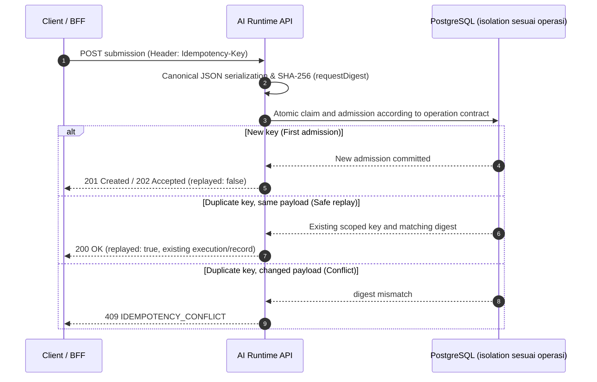

# Application API Contract

_\*Application execution contract v1 — baseline 0.2. M2 mengaktifkan subset gateway `/v1` untuk `chat`, `generate`, `structured_generate`, execution read/cancel, dan SSE events; agent/tool/session/upload portions pada spesifikasi ini tetap target M3._* Owner requirement: [ADR-0001](../adr/0001-application-ownership.md), [ADR-0002](../adr/0002-managed-envelope.md). JSON berikut ilustratif tetapi harus valid; nilai profile/artifact adalah identifier contoh, bukan resource yang sudah dibuat.

## Implemented scope: lab, resources, gateway, compatibility, dan runner authority

Local Contract Lab berjalan di `/api/m0/*` dan tetap validation-only. Gateway M2 aktif pada `/v1/*` untuk direct model execution serta pada mirror browser `/api/v1/*`; [runtime OpenAPI](../../contracts/runtime.openapi.json) dan [BFF OpenAPI](../../contracts/bff.openapi.json) adalah source-generated surface aktif. [Planned execution OpenAPI](../../contracts/execution-v1.planned.openapi.json) tetap mendeskripsikan target yang lebih luas untuk agent/tool/session/upload semantics yang belum aktif. [Shared schemas](../../contracts/schemas.json) dan [panduan M0](../development/M0.md) melengkapi batas Contract Lab.

### Source saat ini

[HTTP API aktual](../implementation/HTTP-API.md) mendokumentasikan 53 registered operations: `/api/m0` lab, active gateway `/v1` + BFF mirror `/api/v1`, `/api/v1` resource/assignment, `/api/runner/v1` machine protocol, dan `/api/m1` compatibility. [Runtime OpenAPI](../../contracts/runtime.openapi.json) dan [BFF OpenAPI](../../contracts/bff.openapi.json) sesuai source; assignment/runner/inbox/registration tidak semuanya diekspos oleh browser.

Resource mutations sudah memakai receipt + expectedRevision, collection reads punya keyset pagination dan overview count. M1 admission masih metadata profileRef/inputDigest, bukan schema prompt /v1 di bawah. Cancel M1 memberi 201 untuk durable intent, berbeda dari target 200/202. X-Request-ID tersedia; traceparent, X-Execution-ID dan provider deadline propagation pada bagian target bukan fitur end-to-end yang sudah aktif.

Bagian 1–10 menjelaskan execution design kecuali subsection yang secara eksplisit menyebut implemented client. Rujukan bentuk/status API aktif tetap catalogue di atas, bukan contoh /v1 target.

## 1. Transport dan identitas

HTTPS wajib di deployment produksi. Service credential ber-scope atau delegated user token divalidasi oleh platform. Application/actor diturunkan dari token dan binding server. Body tidak dapat mengganti identity. Browser secara default memakai app BFF; no provider key di client.

Header umum: `Authorization`, `Idempotency-Key` untuk submission, `traceparent` opsional, `Content-Type: application/json`. `X-Request-ID` adalah server request ID. `X-Execution-ID` dikembalikan setelah admission committed. Trace/correlation user bukan bukti authority.

## 2. Resource dan operasi

| Method/path                        | Request                                                        | Response / semantics                                                 |
| ---------------------------------- | -------------------------------------------------------------- | -------------------------------------------------------------------- |
| POST `/v1/chat`                    | Profile, messages, optional context; capability fixed chat     | JSON 200 atau SSE 200; accepted execution durable, tanpa agent queue |
| POST `/v1/generate`                | Profile, prompt/input; capability generate/structured_generate | JSON 200 atau SSE jika profile mendukung                             |
| POST `/v1/executions`              | Common envelope dengan capability                              | 202 + execution snapshot/Location; asynchronous execution            |
| GET `/v1/executions/{id}`          | Authorized read                                                | Snapshot otoritatif termasuk result/accounting state                 |
| GET `/v1/executions/{id}/events`   | Optional `Last-Event-ID`                                       | SSE 200 atau 410 cursor expired dengan snapshot URL                  |
| POST `/v1/executions/{id}/cancel`  | Optional reason                                                | 202 jika cancel intent baru/ongoing; 200 jika sudah terminal         |
| GET `/v1/executions`               | Filter process/step/conversation/status + page cursor          | Scoped list; tidak boleh enumerate application lain                  |
| GET `/v1/usage`                    | Filter time/process/step/execution + page cursor               | Scoped observations/aggregates, completeness dan pending total       |
| GET `/v1/capabilities`             | Caller-scoped request                                          | Published profiles/capabilities yang caller boleh gunakan            |
| POST `/v1/artifacts`               | Metadata upload intent                                         | Scoped upload grant dan artifact ID                                  |
| POST `/v1/artifacts/{id}/complete` | Checksum/size manifest                                         | Verified metadata atau error; bukan result promotion                 |
| GET `/v1/artifacts/{id}`           | Authorized read                                                | Metadata + short-lived read grant bila diizinkan                     |

Public endpoint session/approval tambahan tidak diklaim tersedia pada MVP. Same-runtime `session_ref` dapat dipakai oleh profile yang sudah lulus tests; approval-required tool yang belum punya approved channel ditolak.

## 3. Envelope dan validation

| Field         | Required                              | Arti/aturan                                                                                                            |
| ------------- | ------------------------------------- | ---------------------------------------------------------------------------------------------------------------------- |
| `profile`     | Ya                                    | Published name/version atau alias yang server resolve menjadi immutable snapshot                                       |
| `capability`  | Ya pada executions; fixed pada facade | `chat`, `generate`, `structured_generate`, `agent_execute`; canonical semantics ada di [CAPABILITIES](CAPABILITIES.md) |
| `input`       | Ya                                    | Discriminated shape sesuai capability; unknown schema rejected                                                         |
| `context`     | Tidak                                 | Opaque process_id, step_id, conversation_id, parent_execution_id, safe labels                                          |
| `constraints` | Tidak                                 | Caller dapat menurunkan timeout/output bounds yang profile izinkan                                                     |
| `session_ref` | Tidak                                 | Platform session ID, bukan raw runtime session path; scope/version checked                                             |
| `stream`      | Pada facade                           | Default false; tidak menambah kemampuan yang tidak didukung profile                                                    |

`process_id` dan `job_id` tidak menjadi dua authority; canonical field adalah `process_id`. SDK aplikasi boleh memetakan job ID miliknya ke field itu. `step_id` dapat berdiri sendiri sebagai label, tetapi tidak mengasumsikan platform mengetahui DAG bisnis. Parent execution reference harus authorized. Per-request secret, arbitrary pluginDir, filesystem path, shell command template, atau unrestricted provider override dilarang.

Unknown capability/profile denied sebelum provider call. JSON Schema/enum/output validation platform memeriksa kontrak teknis, bukan domain acceptance. Truncation, invalid schema, refusal, atau filtered output tidak dipromosikan menjadi sukses schema-valid tanpa penanda.

## 4. Direct chat tanpa job/plugin

```json
{
  "profile": "chat-default@1",
  "input": {
    "messages": [
      {
        "role": "user",
        "content": [{ "type": "text", "text": "Jelaskan hasil rapat ini." }]
      }
    ]
  },
  "context": { "conversation_id": "chat-42" },
  "stream": true
}
```

`conversation_id` boleh dihilangkan. History yang diperlukan dikirim app atau direferensikan lewat session yang authorized; platform tidak otomatis membaca seluruh percakapan dari conversation ID. Input content pertama mendukung text dan authorized artifact reference sesuai capability matrix; future multimodal types menggunakan schema revision, bukan opaque vendor payload yang tidak tervalidasi.

Untuk streaming POST gunakan client fetch/SDK. Untuk reconnect, gunakan `GET .../events`; reconnect tidak mengulang POST. Native EventSource memiliki batas transport/auth sendiri; app BFF atau streaming client harus menangani HTTP 410 dan token expiry secara eksplisit (rujukan protokol: R06 di [SOURCES](../reviews/SOURCES.md)).

## 5. Structured generation

```json
{
  "profile": "fare-interpretation@1",
  "capability": "structured_generate",
  "context": { "process_id": "fare-123", "step_id": "interpret" },
  "input": {
    "prompt": "Klasifikasikan fragmen aturan yang diberikan.",
    "response_schema": {
      "type": "object",
      "properties": {
        "category": {
          "type": "string",
          "enum": ["allowed", "restricted", "unknown"]
        }
      },
      "required": ["category"],
      "additionalProperties": false
    }
  },
  "stream": false
}
```

Facade generate memakai schema dari profile atau schema caller yang policy izinkan, dengan batas ukuran/complexity. Requested schema hash dicatat. Partial streamed JSON bukan final validated result; app menunggu completion/snapshot dan memvalidasi aturan bisnisnya sendiri.

## 6. Agent execution Scribe

```json
{
  "profile": "scribe-document@2",
  "capability": "agent_execute",
  "context": { "process_id": "scribe-job-123", "step_id": "generate-document" },
  "input": {
    "prompt": "Buat draft dokumen sesuai standar yang direferensikan.",
    "artifact_refs": ["artifact-video-123", "artifact-standard-v3"]
  }
}
```

Plugin/harness digest terikat profile; caller boleh memilih hanya package version yang profile grant izinkan. Proses selanjutnya (validasi, review, publish) tetap diputuskan Scribe.

## 7. Snapshot dan result

```json
{
  "execution_id": "exec-123",
  "revision": 7,
  "status": "COMPLETED",
  "status_reason": null,
  "profile_revision": "chat-default@1",
  "attempts": [
    {
      "attempt_id": "attempt-1",
      "status": "SUCCEEDED",
      "authority": "RELEASED",
      "local_compute": "NOT_APPLICABLE",
      "external_operations": "NONE",
      "accounting": "PENDING_RECONCILIATION"
    }
  ],
  "result": { "kind": "text", "text": "Hasil AI.", "artifact_refs": [] },
  "usage": {
    "measurement_status": "partial",
    "cost_basis": "unknown",
    "provider_cost": null
  },
  "links": {
    "self": "/v1/executions/exec-123",
    "events": "/v1/executions/exec-123/events"
  }
}
```

`result.kind`: text, structured, artifacts, atau mixed sesuai profile. Error model/provider disimpan pada attempt dengan detail sanitized. Response dapat memuat requested/resolved model/provider untuk audit jika caller berhak, tanpa credential/raw secret. Null berarti tidak diketahui/tidak tersedia, bukan nol. `revision` monoton untuk durable snapshot; bukan token sequence.

## 8. Idempotency

Scope key: application + operation family `execution-submit` + caller key. Facade dan generic submission dinormalisasi ke common digest agar key yang sama tidak membuat duplikasi lintas endpoint. Digest mencakup typed input, profile reference, constraints, authorized artifact hashes, session revision bila relevan. Trace ID/timestamp transport dikecualikan.

Satu unique record mengikat key ke canonical request digest dan execution. Same key + same digest mengembalikan execution semula, termasuk ketika masih running. Same key + different digest memberi 409 `IDEMPOTENCY_CONFLICT`. Concurrent duplicate diserialisasi oleh unique constraint/transaction, bukan check-then-insert di cache.



Alias profile disnapshot pada acceptance pertama; replay memakai snapshot lama, bukan alias yang telah bergerak. Ketika retained key melebihi retention, policy tombstone/expired-key mencegah silent duplicate; target retention harus melampaui retry horizon aplikasi. Unknown response setelah admission: caller query/retry dengan key sama, bukan membuat key baru.

Idempotency submission tidak menghapus biaya internal retry. Retry attempt memiliki ID baru, authorized budget baru/remaining envelope, dan operation key tool yang stabil. Respons replay untuk streaming memberi execution reference untuk attach stream/snapshot, bukan me-replay model dengan provider.

### 8.1 Client turn lifecycle and replay ownership

One logical submission owns one stable idempotency key and canonical payload. A new user turn creates a new key; timeout, reconnect, or a lost acknowledgement does not. Idempotent admission prevents duplicate admission records for that scope/key; it does not guarantee exactly-once provider execution or zero duplicate cost after an ambiguous upstream call. Attempt fencing, provider idempotency/status support, and accounting reconciliation remain separate controls.

The implemented browser client permits **up to three total attempts only on route-declared replay-safe operations**: lab validation, M1 admission and receipt-backed resource mutations. Other operations default to one. The BFF always performs one upstream attempt. A failed response after dispatch can remain unknown even after retries; the UI never asserts rollback or silently changes the logical key. Same key with a different canonical payload is a conflict, not a retry. Retry-After is a delay hint, not replay permission.

The implemented client already uses one retry-owning layer, a monotonic overall deadline, jitter and a per-client retry budget. It retries eligible network or HTTP 502/503/504 failures, not arbitrary 4xx, invalid responses or caller cancellation. Future runtime SDKs must implement their own verified operation policy without multiplying proxy/client retries. A planned stream resumes by GET against its existing execution, not by repeating model submission.

A validated HTTP response confirms the operation represented by that response, not completion of an unrelated health refresh or final AI execution. For asynchronous runtime submission, an accepted response and pending execution are different states. Client cancellation defaults to detachment; only the explicit authorized cancellation contract records cancel intent. Editing a local lab draft invalidates its old UI generation but does not roll back any already committed validation record.

See [ADR-0029](../adr/0029-replay-resources-runner-authority.md) and [implemented HTTP API](../implementation/HTTP-API.md) for current behavior. ADR-0028 records the earlier one-attempt hardening revision. Neither revision promises exactly-once provider execution.

## 9. Target execution error taxonomy (bukan seluruh code API aktif)

| HTTP | Code                                                 | Semantics                                                              |
| ---- | ---------------------------------------------------- | ---------------------------------------------------------------------- |
| 400  | INVALID_REQUEST                                      | Malformed payload/schema/limits                                        |
| 401  | UNAUTHENTICATED                                      | Credential missing/invalid                                             |
| 403  | POLICY_DENIED                                        | Identitas valid, capability/profile/action ditolak                     |
| 404  | NOT_FOUND                                            | Resource tidak ada atau disembunyikan karena tidak authorized          |
| 409  | IDEMPOTENCY_CONFLICT / SESSION_BUSY                  | Konflik logical request atau single-writer session                     |
| 410  | STREAM_RESUME_EXPIRED / RESOURCE_EXPIRED             | Replay/data sudah di luar retention yang dinyatakan                    |
| 422  | UNSUPPORTED_CAPABILITY                               | Profile/input tidak kompatibel sebelum eksekusi                        |
| 429  | BUDGET_EXHAUSTED / RATE_LIMITED / CAPACITY_EXHAUSTED | Tidak admitted; tidak mengubah budget. Retry-After hanya bila bermakna |
| 503  | DEPENDENCY_UNAVAILABLE                               | Tidak dapat melakukan safe admission/dispatch                          |
| 504  | WAIT_TIMEOUT                                         | Batas synchronous wait; execution ID/status tetap dapat di-query       |

Error setelah SSE HTTP 200 menjadi `execution.failed`/control event dan snapshot, bukan mengganti status HTTP yang sudah dikirim. Provider timeout setelah request terkirim ditandai outcome ambiguity; `retryable` tidak berarti caller aman membuat logical operation baru.

```json
{
  "error": {
    "code": "BUDGET_EXHAUSTED",
    "message": "Alokasi eksekusi tidak tersedia.",
    "retryable": false,
    "request_id": "request-123",
    "execution_id": null
  }
}
```

## 10. Target execution cancellation, pagination, dan versioning

Cancel idempotent per execution; alasan baru dapat diaudit tetapi tidak menciptakan second cancel command. Terminal execution tidak diubah kembali ke running/cancelled hanya karena request terlambat. Cancel-versus-complete dilinearisasi CAS server; lihat [lifecycle](EXECUTION-LIFECYCLE.md).

List/query memakai opaque page cursor terikat filter dan authorization scope, stable order (created_at, id), batas page size yang dipublikasikan. Cursor bukan permission. Usage aggregation mengembalikan as_of, units, cost basis, pending count; bukan hanya satu total yang menyembunyikan incomplete data.

Version v1 mengizinkan additive optional fields/events dengan schema version; unknown enum tidak boleh dianggap success. Breaking change memakai v2/migration window. Payload limits, deadline defaults, retention, supported capabilities, dan deprecation windows harus dipublikasikan setelah dikalibrasi; tidak ditebak sebagai properti vendor.

## 11. Control-plane management surface

Application execution API dan management API dipisahkan secara authority walaupun berada pada satu platform. Target control-plane surface mencakup Applications, Execution Profiles, AI Connections, Credential Bindings, Plugin Versions, Runner Pools/Nodes, Budgets/Policies, dan Audit. Detail resource dan invariants ada di [CONTROL-PLANE](CONTROL-PLANE.md).

Management routes membutuhkan operator/admin authorization; execution caller tidak mendapat kemampuan tersebut hanya karena memiliki application token. Response connection/runner tidak pernah mengembalikan secret material.

Runtime request tetap capability/profile oriented. Field seperti provider credential, secret, runner host, plugin directory, atau unrestricted tool list adalah server authority dan harus ditolak bila dikirim caller pada contract yang tidak mengizinkannya.
