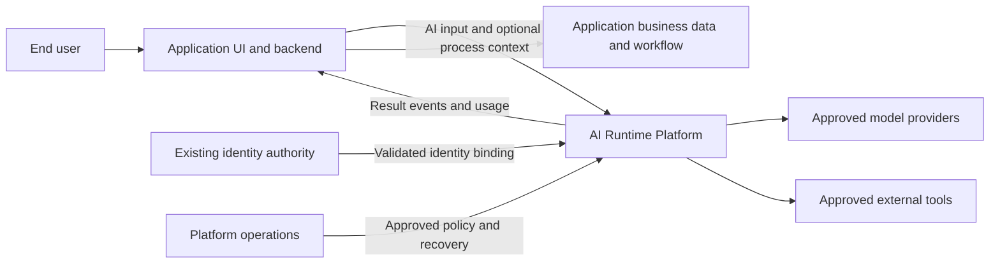
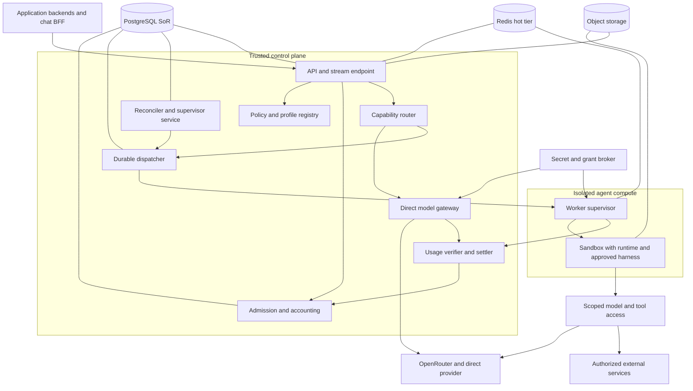
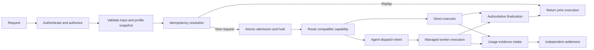

# D01–D03 — Context, Containers, dan Components

**Implementation boundary — 24 September 2026:** Target container/components below include gateway and workers not present in the running source. The actual Next.js/BFF, API and PostgreSQL boundaries are shown in I01. See [I01–I04](10-implemented-contracts.md) and [current state](../implementation/CURRENT-STATE.md).

**Authored baseline 0.2 views.** Diagram bukan deployment existing. Boundary otoritatif: [BOUNDARIES](../architecture/BOUNDARIES.md); overview: [ARCHITECTURE](../architecture/ARCHITECTURE.md).

## D01 — System context

Domain data/workflow tetap di app. Platform tidak memanggil database aplikasi tanpa tool contract/authorization yang disetujui. Identity integration adalah boundary target, bukan klaim existing IdP telah tersambung.

## D02 — Logical container view

Arrows menggambarkan interaksi logis, bukan akses tanpa auth. Redis bukan source financial reservation; worker tidak menulis PG langsung. Runtime native provider access hanya melalui scoped binding yang enforcement-nya dibuktikan.

## D03 — Control-plane component flow

Finalization dan settlement adalah jalur berbeda. App menerima result tanpa harus menunggu seluruh provider billing lengkap. INV-01/02/08/09.
