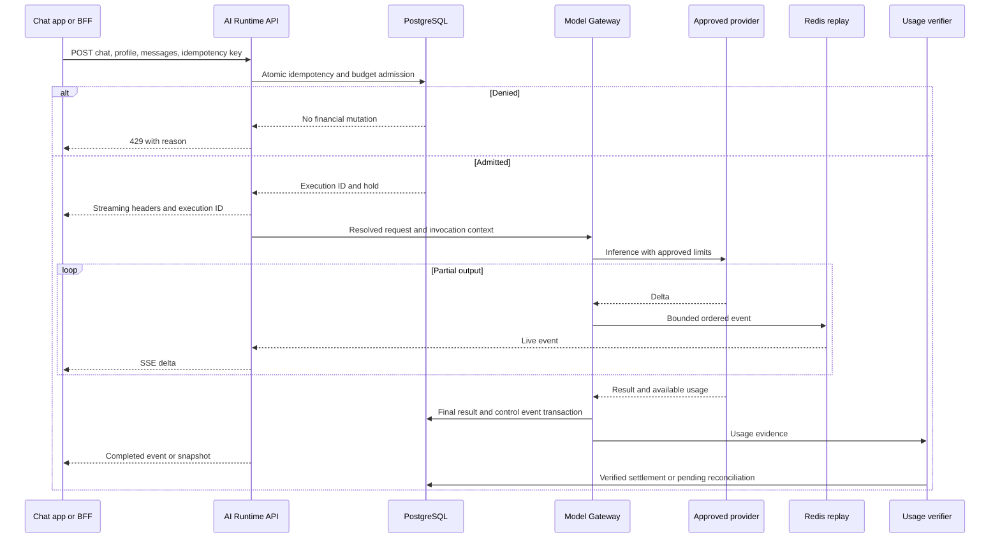
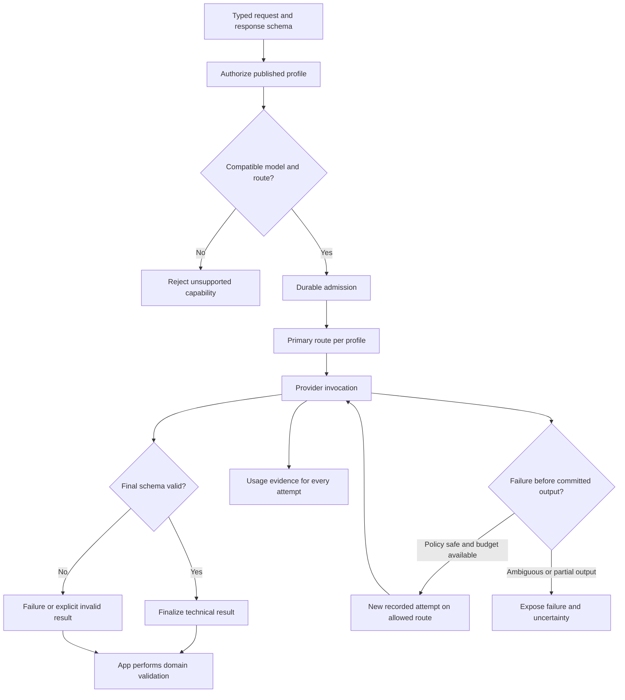

# D04–D05 — Direct Chat dan Structured Generation

**Authored flow.** Kontrak: [API](../contracts/API.md), [profiles](../contracts/PROFILES-ADAPTERS.md). Business job dan plugin tidak diperlukan.

## D04 — Direct streaming chat

Tidak ada long-agent queue pada direct path. Lost final usage tidak mengubah completed result menjadi failed; exposure tetap pending. Client reconnect menggunakan events GET, bukan POST ulang tanpa key.

## D05 — Structured output routing dan validation

Fallback arrow adalah conditional retry, bukan semua failures. Domain validation dan next-step decision tetap di app. Provider-specific schema support diverifikasi saat profile publication.
