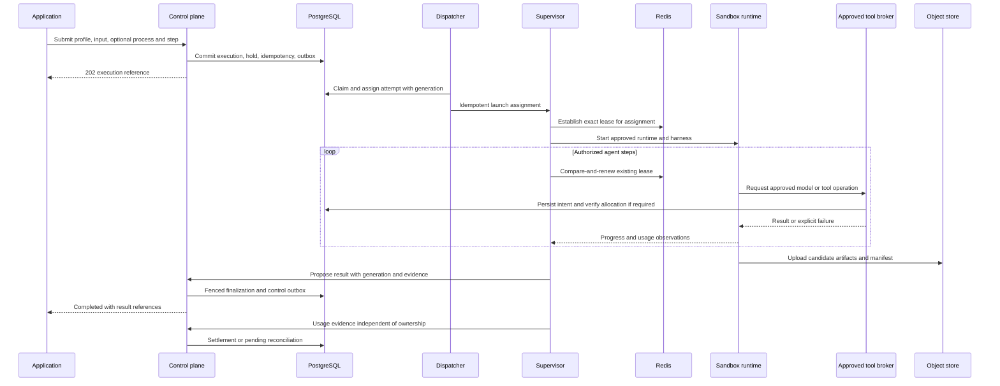
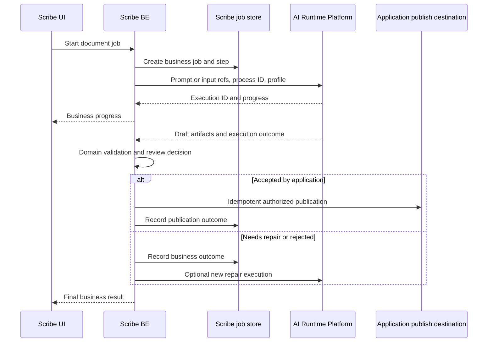
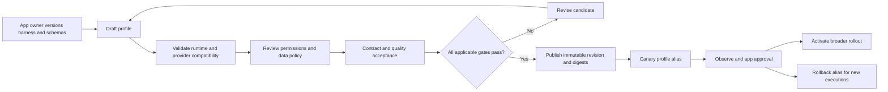

# D06–D08 — Agent, Scribe, dan Profile Publication

**Implementation boundary — 24 September 2026:** Agent and plugin publication flows remain target design. Immutable local profile revisions exist, but plugin approval/materialization and execution dispatch do not. See [I01–I04](10-implemented-contracts.md) and [current state](../implementation/CURRENT-STATE.md).

**Authored flow.** Referensi: [lifecycle](../contracts/EXECUTION-LIFECYCLE.md), [tools](../contracts/TOOLS-PLUGINS.md), [artifacts](../contracts/ARTIFACTS-SESSIONS.md).

## D06 — Agent happy path

Diagram memisahkan sandbox dan supervisor. Runtime yang tidak dapat memediasi per-step model access hanya eligible bila whole-execution limits/envelope-nya terbukti; diagram bukan klaim broker tersedia pada semua runtime.

## D07 — Scribe v2 ownership flow

AI execution COMPLETED tidak berarti dokumen diterima atau sudah dipublikasikan. Repair adalah keputusan Scribe; platform tidak menyimpan state bisnis dokumen.

## D08 — Profile dan package publication

Existing execution tetap memakai snapshot pinned. Security revoke dapat menghentikan version melalui audited control, bukan mengubah snapshot historis.
