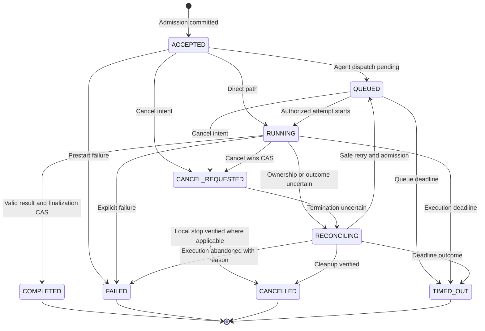
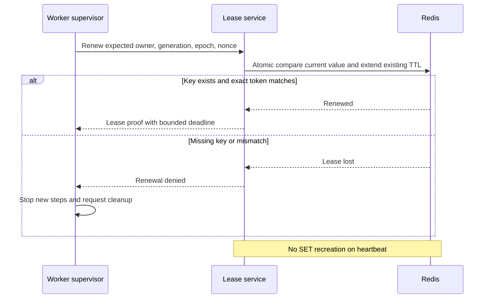
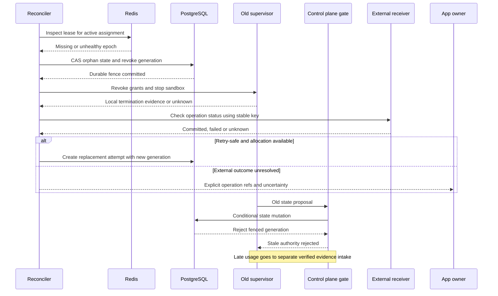
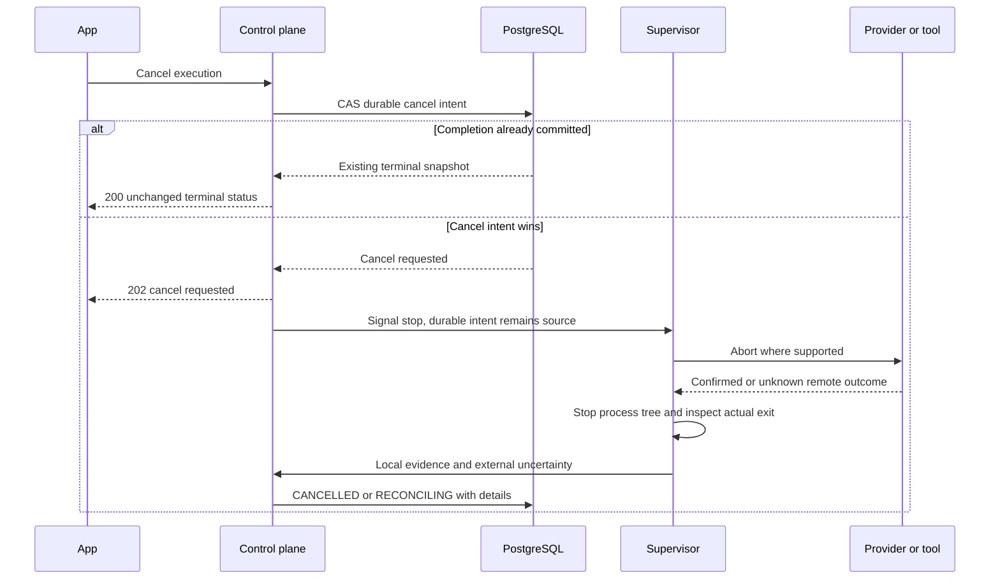

# D09–D12 — State, Lease, Orphan, dan Cancel

**Implementation boundary — 24 September 2026:** Full lifecycle, Redis leases and recovery below remain targets. Current manual fencing and cancel-intent storage are implemented; state labels differ from parts of the physical M1 schema and no supervisor kill/restart is implied. See [I01–I04](10-implemented-contracts.md) and [current state](../implementation/CURRENT-STATE.md).

**Authored corrected flows.** Canonical preconditions ada di [LIFECYCLE](../contracts/EXECUTION-LIFECYCLE.md) dan [OWNERSHIP-RECOVERY](../reliability/OWNERSHIP-RECOVERY.md). Diagram menyederhanakan details, tidak menggantikan transaction semantics.

## D09 — Public execution lifecycle

Accounting/external reconciliation dapat berlanjut sesudah terminal. COMPLETED tidak menunggu SETTLED. Required external mutation unknown tidak dipromosikan jadi complete.

## D10 — Conditional lease renewal

Routine renewal tidak UPDATE heartbeat PG. Durable authority cutover tetap transaction CAS; Redis TTL bukan atomic global ownership proof.

## D11 — Orphan quarantine dan safe retry

Old supervisor hanya mengirim proposal melalui control gate; PG interface tidak diekspos langsung ke worker. Remote mutation yang telah terjadi tidak dibatalkan oleh fence.

## D12 — Cancel versus complete

Signal ACK saja bukan termination proof. Reservation/usage settlement mengikuti exposure, tidak dilepas hanya karena cancel request diterima.
