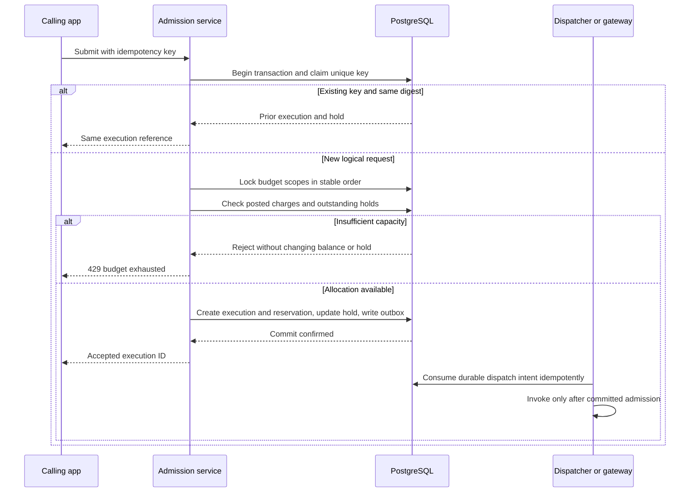
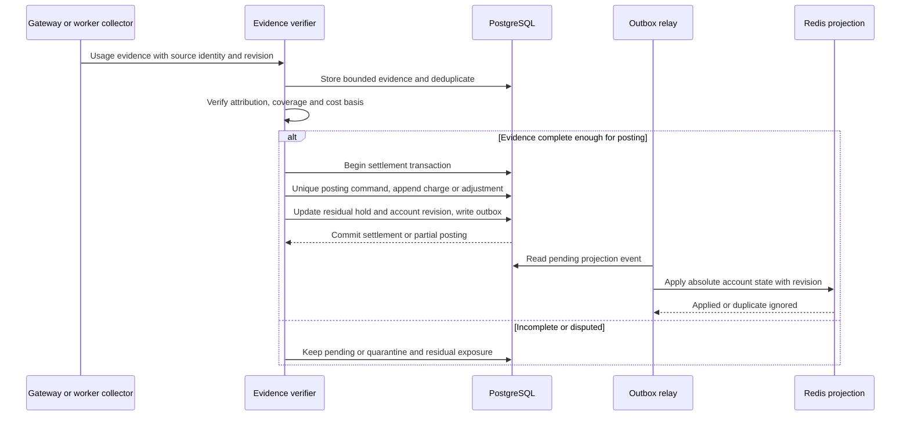
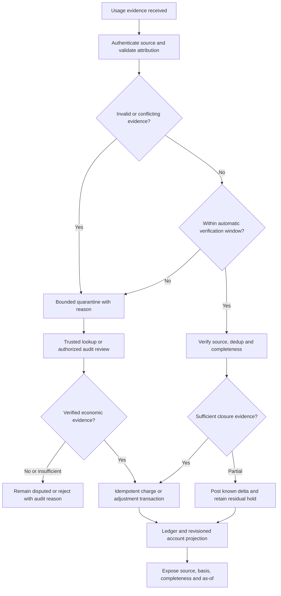

# D13–D15 — Admission, Settlement, dan Late Usage

**Implementation boundary — 24 September 2026:** PostgreSQL admission, reservations, ledger and inbox/outbox have local tests. Redis projections and automated late-evidence verification in these target flows are not implemented; runner evidence currently enters quarantine. See [I01–I04](10-implemented-contracts.md) and [current state](../implementation/CURRENT-STATE.md).

**Authored corrected flows.** Financial authority: [ACCOUNTING](../data/ACCOUNTING.md), [ADR-0007](../adr/0007-durable-accounting.md), [ADR-0008](../adr/0008-late-usage.md). Redis tidak menjadi satu-satunya saldo/hold.

## D13 — Atomic admission tanpa mutasi pada denial

Diagram menunjukkan transaction grouping, bukan menahan transaksi selama provider call. Case key sama dengan digest berbeda adalah 409 conflict, tidak ditampilkan untuk menjaga fokus flow.

## D14 — Settlement atomic dan projection idempotent

Crash sesudah PG commit sebelum Redis update diselesaikan oleh outbox replay. Duplicate event tidak mengembalikan saldo dua kali. Partial usage tidak menyebabkan seluruh hold dilepas.

## D15 — Late usage dan adjustment setelah fast-path window

Neither fast-path nor audit path restores stale-worker authority. Candidate 15-minute window controls verification routing, not whether a real provider charge exists. Execution result remains unchanged by financial adjustment.
