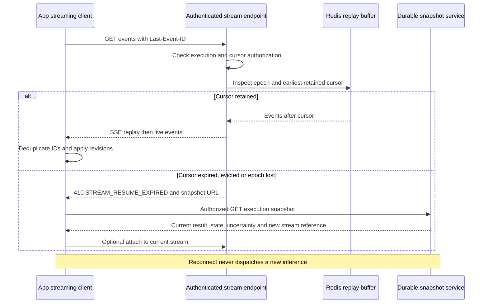
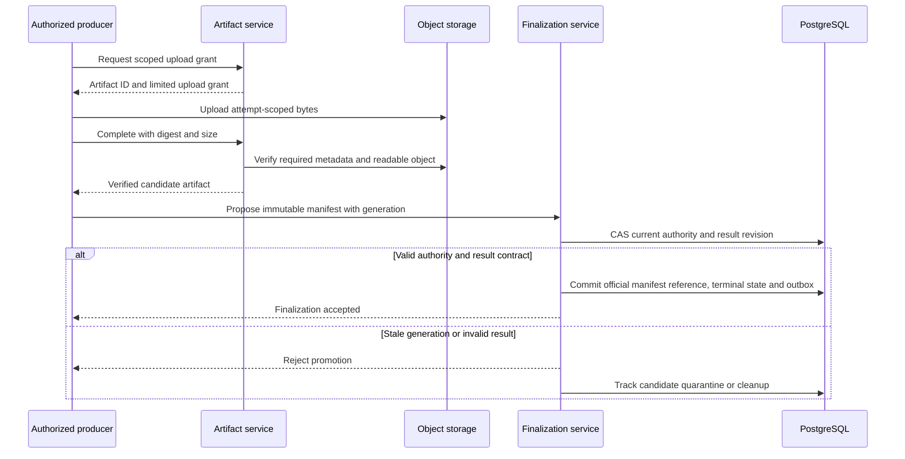
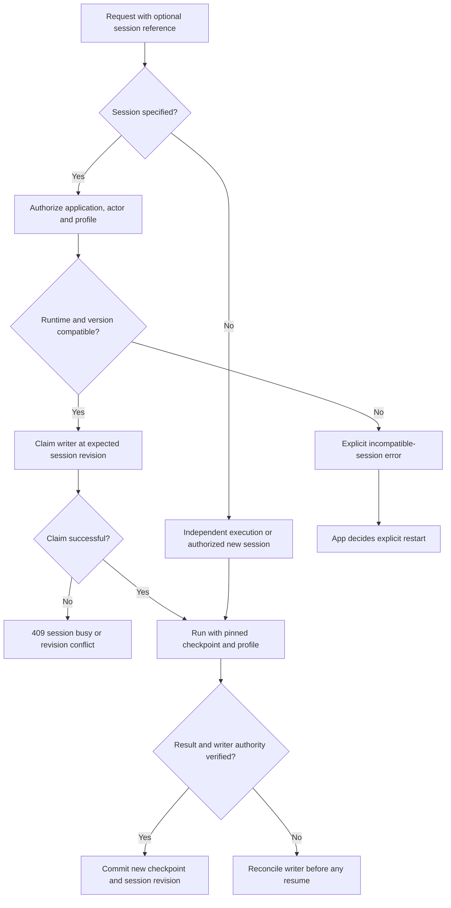

# D16–D18 — Stream Recovery, Artifacts, dan Sessions

**Authored flows.** Canonical references: [EVENTS](../contracts/EVENTS-STREAMING.md), [ARTIFACTS-SESSIONS](../contracts/ARTIFACTS-SESSIONS.md).

## D16 — SSE reconnect dan explicit resync

Snapshot service adalah authenticated API backed by SoR; client tidak membaca database langsung. Jika gap terjadi sesudah SSE headers terkirim, reset event/close menggantikan HTTP 410 yang tidak lagi bisa diubah.

## D17 — Artifact candidate versus official result

Upload success alone is not execution success. Object upload and PG result commit are separate operations; stable artifact IDs, checksum and idempotent finalization handle the crash window.

## D18 — Scoped single-writer runtime session

Idempotent submission replay returns the original execution before modifying session state. App conversation ID is not itself a resumable runtime session or a grant to another app's history.
