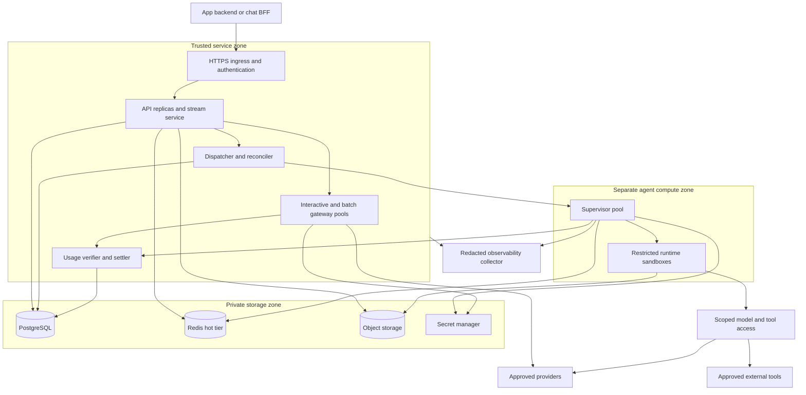
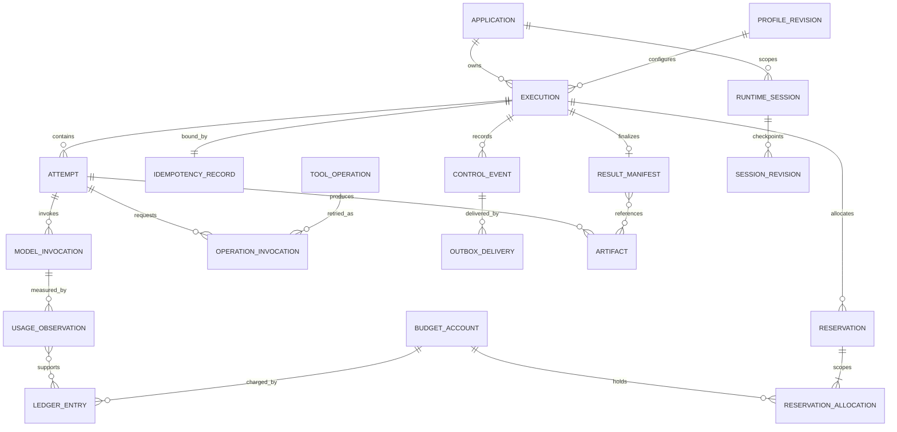
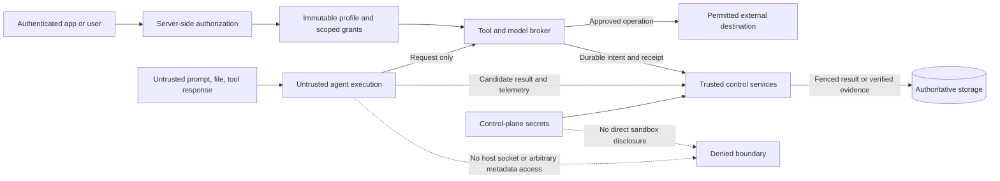

# D19–D21 — Deployment, Data, dan Trust Boundaries

**Authored target views, not an installed topology.** [DEPLOYMENT](../operations/DEPLOYMENT.md), [DATA-MODEL](../data/DATA-MODEL.md), [SECURITY](../security/SECURITY.md).

## D19 — Initial deployment topology

Replica counts, cloud/region, HA policy and sandbox technology remain open decisions. All edges imply authenticated scoped access, not unrestricted network reachability. Separate workload pools protect interactive traffic from long agent jobs.

## D20 — Logical entity relationships

Logical names clarify relationships; physical DDL/partitioning is future implementation. Usage evidence can also originate from runtime/tool summaries, so model-invocation relation is optional where source granularity is unavailable. Result-manifest relation refers official final output; candidate manifests are attempt-scoped. Session use is optional. Reservation allocation supports multiple budget scopes in one admission.

## D21 — Trust and permission boundaries

Model text cannot grant permission. Evidence intake is not ledger-write authority. A signed usage report still requires verification; a successful tool call still requires app-level business acceptance where appropriate.
