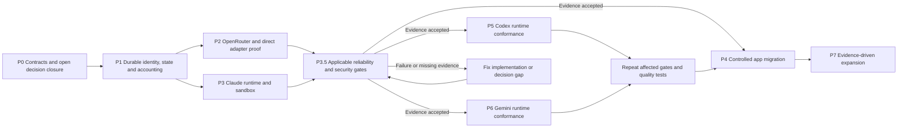
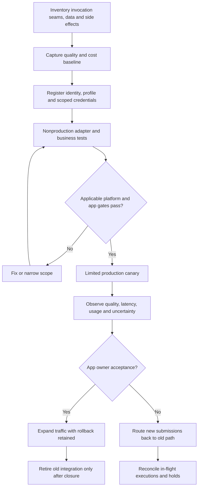

# D22–D23 — Implementation Dependencies dan Migration

**Implementation boundary — 24 September 2026:** Dependency arrows express delivery requirements, not that every preceding production gate has already passed. P1 local tests and manual runner authority do not close P3/P3.5. See [I01–I04](10-implemented-contracts.md) and [current state](../implementation/CURRENT-STATE.md).

**Authored plan visualization.** M0 is runnable and M1 durable foundation plus receipt/resource/runner-authority extensions are implemented locally. Full gateway/agent execution milestones remain PLANNED and P3.5 production approval is BLOCKED. Canonical source: [PLAN](../PLAN.md), [ROADMAP](../ROADMAP.md).

## D22 — Dependency and readiness flow

P2/P3 may overlap once common contracts are stable. Nonproduction trials precede production gates; production cutover does not. Multi-runtime support is not required before first shared-platform value.

## D23 — Per-application migration and rollback

No duplicate stateful shadow execution. Rollback preserves idempotency and operation identity; it does not rerun ambiguous remote mutations. Job/domain state remains in the app throughout migration.
