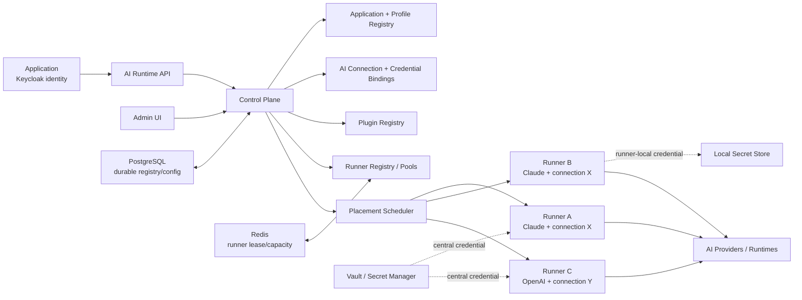

# Control Plane, AI Connections, dan Distributed Runner Fleet

## Placement rule

Eligible runner = runtime compatible + application/profile authorized + AI connection available + credential locality satisfied + capacity + environment/region/data policy + version compatible + lifecycle `RUNNING`.

Multiple runner bindings may represent one logical AI Connection and one upstream quota group. More runners therefore do not automatically imply more provider quota.

Plugin/workspace are optional execution capabilities. Plugin artifacts are resolved from the registry and materialized only inside isolated workers. Remote app-owned tools may use MCP or typed HTTP/RPC.
