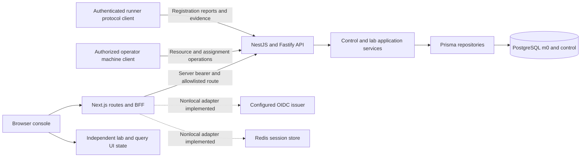
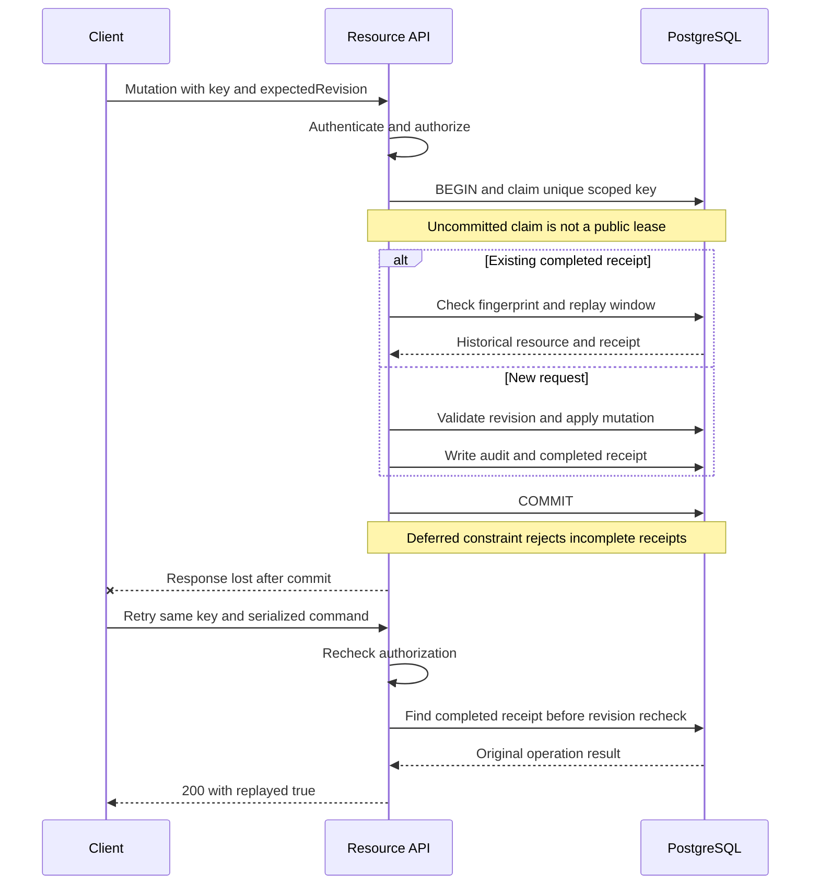
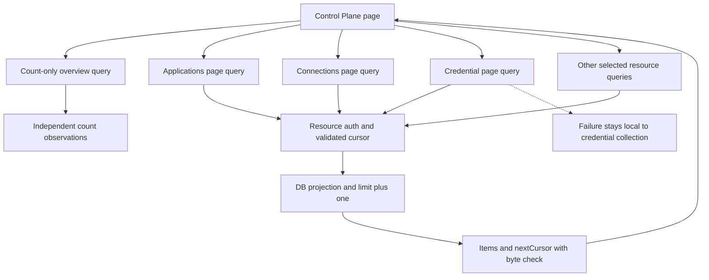
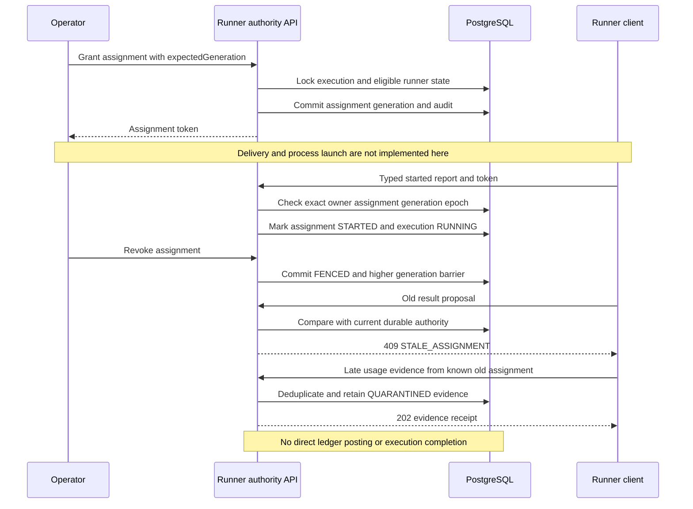

# I01–I04 — Implementasi HTTP, Receipt, Resources, dan Runner Authority

**As-built source view, 24 September 2026.** Diagram ini menggambarkan jalur yang terdaftar pada source sekarang, bukan live provider runtime atau topology produksi. [Kondisi aktual](../implementation/CURRENT-STATE.md), [operasi HTTP](../implementation/HTTP-API.md), dan [ADR-0029](../adr/0029-replay-resources-runner-authority.md) menjelaskan detail yang disederhanakan oleh gambar.

## I01 — Boundary proses dan HTTP aktif

Local mode memakai fixture credentials di server dan tidak menghubungi issuer/Redis. Garis putus-putus adalah kode integrasi nonlocal, bukan bukti bahwa layanan eksternal telah dideploy. Tidak ada Model Gateway, sandbox launcher, atau Redis runner-lease coordinator pada view aktif ini.

## I02 — Management receipt dan lost acknowledgement

Concurrent inserts coordinate through the database unique constraint; Serializable conflicts can retry within the bounded transaction policy. Same key with a different fingerprint gives 409. A new stale-revision command still conflicts. Expired receipt gives 410 and retains the key. No 425 or TTL takeover is used. This is the resource management path; M0 validation, M1 admission and runner grant/revoke have their own transaction implementation.

## I03 — Resource queries tidak bergantung pada mega-snapshot

Each collection owns its cursor and loading/error state. Maximum page size is 100, default 20. Outbox list excludes payload and credential list excludes secretRef at query time. The overview is not an atomic database-wide snapshot. Legacy /api/m1/control-plane remains a compatibility route but is not called by this console data path.

## I04 — Exact fencing dan late evidence

A fresh authorized result.proposed stores a proposal and one outbox event but does not finalize an AI result or free capacity. Fencing checks protect platform state only; an already accepted provider/tool effect is not undone. Redis heartbeat/lease recovery, automatic reassignment, process supervision and evidence verification remain target work.

## Source mapping

| View | Source                                                                                                                                                                                |
| ---- | ------------------------------------------------------------------------------------------------------------------------------------------------------------------------------------- |
| I01  | [BFF](../../apps/web/src/server/api-gateway/forward.ts), [API composition](../../apps/api/src/app.module.ts)                                                                          |
| I02  | [manageReceipted](../../apps/api/src/modules/control-plane/infrastructure/prisma-m1.repository.ts), [receipt migration](../../prisma/migrations/0005_contract_receipts/migration.sql) |
| I03  | [Resource reader](../../apps/api/src/modules/control-plane/infrastructure/prisma-resource-reader.ts), [console](../../apps/web/src/features/control-plane/control-plane-page.tsx)     |
| I04  | [Runner authority](../../apps/api/src/modules/control-plane/infrastructure/prisma-runner-authority.ts), [runner schema](../../packages/contracts/src/http/runner.ts)                  |

These diagrams are source documentation; checks of Markdown/Mermaid syntax do not establish distributed-system correctness. Runtime/fault evidence stays in [verification records](../reviews/CONTRACT-EXECUTION.md).
