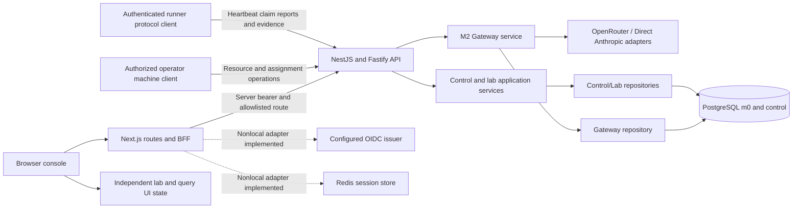
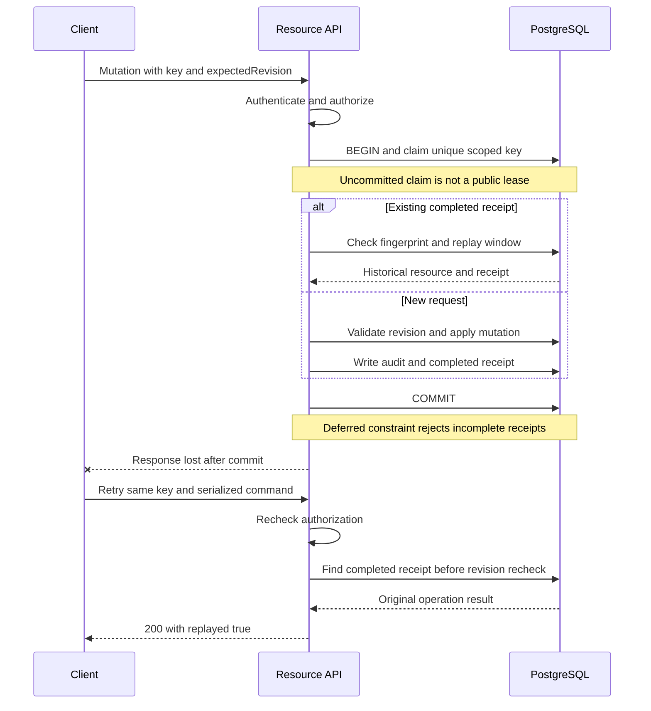
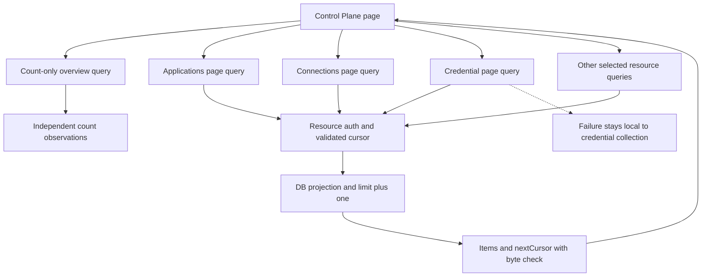
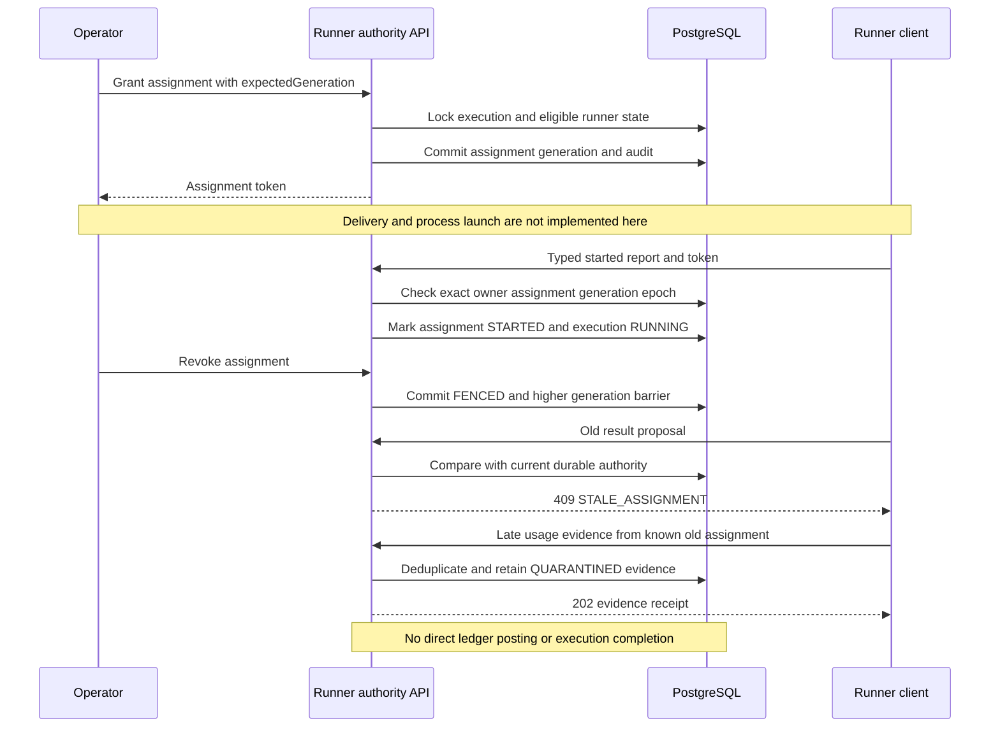
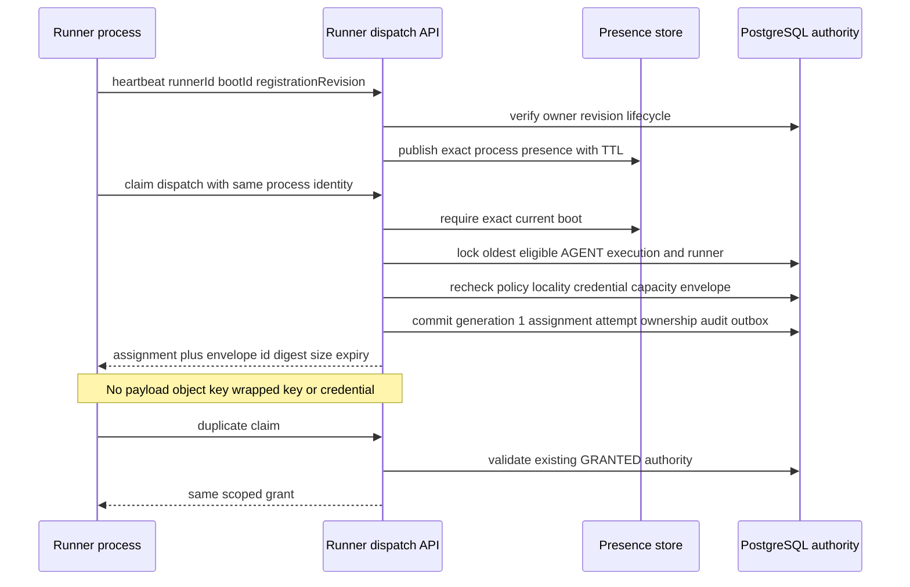

# I01–I06 — Implementasi HTTP, Receipt, Resources, Runner Authority, M2 Gateway, dan Initial Dispatch

**As-built source view, 29 September 2026.** Diagram ini menggambarkan jalur yang terdaftar pada source sekarang, termasuk M2 local model gateway dan initial M3 pull dispatch. Authorized live vendor/runtime smoke dan topology produksi tetap di luar bukti ini. [Kondisi aktual](../implementation/CURRENT-STATE.md), [operasi HTTP](../implementation/HTTP-API.md), [ADR-0029](../adr/0029-replay-resources-runner-authority.md), dan [ADR-0031](../adr/0031-pull-dispatch-and-scoped-runner-grants.md) menjelaskan detail yang disederhanakan oleh gambar.

## I01 — Boundary proses dan HTTP aktif

```mermaid
flowchart LR
    B[Browser console] --> N[Next.js routes and BFF]
    N -->|Server bearer and allowlisted route| A[NestJS and Fastify API]
    A --> M[Control and lab application services]
    A --> G[M2 Gateway service]
    G --> P[OpenRouter / Direct Anthropic adapters]
    G --> R[Gateway repository]
    M --> R2[Control/Lab repositories]
    R --> PG[(PostgreSQL m0 and control)]
    R2 --> PG
    O[Authorized operator machine client] -->|Resource and assignment operations| A
    W[Authenticated runner protocol client] -->|Heartbeat claim reports and evidence| A
    N -.->|Nonlocal adapter implemented| IDP[Configured OIDC issuer]
    N -.->|Nonlocal adapter implemented| S[Redis session store]
    B --> U[Independent lab and query UI state]
```

Local mode memakai fixture identity/session credentials di server dan tidak menghubungi issuer/Redis. Garis putus-putus adalah kode integrasi nonlocal, bukan bukti bahwa layanan eksternal telah dideploy. M2 Model Gateway dan initial runner pull placement aktif secara lokal; payload delivery, sandbox launcher, autonomous agent process, dan lease recovery coordinator belum ada.

## I02 — Management receipt dan lost acknowledgement

```mermaid
sequenceDiagram
    participant C as Client
    participant API as Resource API
    participant DB as PostgreSQL
    C->>API: Mutation with key and expectedRevision
    API->>API: Authenticate and authorize
    API->>DB: BEGIN and claim unique scoped key
    Note over API,DB: Uncommitted claim is not a public lease
    alt Existing completed receipt
        API->>DB: Check fingerprint and replay window
        DB-->>API: Historical resource and receipt
    else New request
        API->>DB: Validate revision and apply mutation
        API->>DB: Write audit and completed receipt
    end
    API->>DB: COMMIT
    Note over API,DB: Deferred constraint rejects incomplete receipts
    API--xC: Response lost after commit
    C->>API: Retry same key and serialized command
    API->>API: Recheck authorization
    API->>DB: Find completed receipt before revision recheck
    DB-->>API: Original operation result
    API-->>C: 200 with replayed true
```

Concurrent inserts coordinate through the database unique constraint; Serializable conflicts can retry within the bounded transaction policy. Same key with a different fingerprint gives 409. A new stale-revision command still conflicts. Expired receipt gives 410 and retains the key. No 425 or TTL takeover is used. This is the resource management path; M0 validation, M1 admission and runner grant/revoke have their own transaction implementation.

## I03 — Resource queries tidak bergantung pada mega-snapshot

```mermaid
flowchart TB
    UI[Control Plane page] --> O[Count-only overview query]
    UI --> A[Applications page query]
    UI --> C[Connections page query]
    UI --> K[Credential page query]
    UI --> X[Other selected resource queries]
    A --> PA[Resource auth and validated cursor]
    C --> PA
    K --> PA
    X --> PA
    PA --> Q[DB projection and limit plus one]
    Q --> P[Items and nextCursor with byte check]
    P --> UI
    O --> N[Independent count observations]
    K -.-> E[Failure stays local to credential collection]
```

Each collection owns its cursor and loading/error state. Maximum page size is 100, default 20. Outbox list excludes payload and credential list excludes secretRef at query time. The overview is not an atomic database-wide snapshot. Legacy /api/m1/control-plane remains a compatibility route but is not called by this console data path.

## I04 — Exact fencing dan late evidence

```mermaid
sequenceDiagram
    participant O as Operator
    participant API as Runner authority API
    participant DB as PostgreSQL
    participant W as Runner client
    O->>API: Grant assignment with expectedGeneration
    API->>DB: Lock execution and eligible runner state
    API->>DB: Commit assignment generation and audit
    API-->>O: Assignment token
    Note over O,W: Delivery and process launch are not implemented here
    W->>API: Typed started report and token
    API->>DB: Check exact owner assignment generation epoch
    API->>DB: Mark assignment STARTED and execution RUNNING
    O->>API: Revoke assignment
    API->>DB: Commit FENCED and higher generation barrier
    W->>API: Old result proposal
    API->>DB: Compare with current durable authority
    API-->>W: 409 STALE_ASSIGNMENT
    W->>API: Late usage evidence from known old assignment
    API->>DB: Deduplicate and retain QUARANTINED evidence
    API-->>W: 202 evidence receipt
    Note over API,DB: No direct ledger posting or execution completion
```

A fresh authorized result.proposed stores a proposal and one outbox event but does not finalize an AI result or free capacity. Fencing checks protect platform state only; an already accepted provider/tool effect is not undone. Exact-process Redis heartbeat is active; lease recovery, automatic reassignment, process supervision and evidence verification remain target work.

## I05 — M2 gateway, safe fallback, dan durable accounting

```mermaid
sequenceDiagram
    participant C as Application/BFF
    participant G as Gateway service
    participant DB as PostgreSQL authority
    participant P1 as Primary provider
    participant P2 as Policy-approved fallback
    C->>G: submit chat/generate/structured request + idempotency key
    G->>DB: durable admission + reservation + claim attempt 1
    G->>P1: provider request
    alt primary succeeds
        P1-->>G: bounded SSE + terminal marker + usage
    else failure proven not-sent before provider/output evidence
        G->>DB: close attempt 1; create durable attempt 2
        G->>P2: fallback request from immutable profile policy
        P2-->>G: bounded SSE + terminal marker + usage
    else partial or ambiguous provider outcome
        G->>DB: mark RECONCILING and retain reservation/evidence
        G-->>C: explicit unknown/reconciliation outcome
    end
    G->>G: validate structured output when requested
    G->>DB: persist provider invocation/result + usage/ledger settlement
    G-->>C: result or SSE terminal event
```

Fallback tidak dipilih bebas oleh caller dan tidak dilakukan setelah partial/unknown output. OpenRouter harus mencapai `[DONE]`; Direct Anthropic harus mencapai `message_stop`. EOF tanpa terminal marker bukan success. Admission capacity/rate limits menggunakan PostgreSQL authority sebelum execution/hold dibuat; rejection tidak meninggalkan reservation. Live provider smoke terotorisasi belum menjadi bukti lokal.

## I06 — Exact-process pull claim dan scoped grant

```mermaid
sequenceDiagram
    participant W as Runner process
    participant API as Runner dispatch API
    participant R as Presence store
    participant DB as PostgreSQL authority
    W->>API: heartbeat runnerId bootId registrationRevision
    API->>DB: verify owner revision lifecycle
    API->>R: publish exact process presence with TTL
    W->>API: claim dispatch with same process identity
    API->>R: require exact current boot
    API->>DB: lock oldest eligible AGENT execution and runner
    API->>DB: recheck policy locality credential capacity envelope
    API->>DB: commit generation 1 assignment attempt ownership audit outbox
    API-->>W: assignment plus envelope id digest size expiry
    Note over API,W: No payload object key wrapped key or credential
    W->>API: duplicate claim
    API->>DB: validate existing GRANTED authority
    API-->>W: same scoped grant
```

Redis/in-memory presence only gates whether the exact process may ask for work; it cannot create or transfer assignment authority. PostgreSQL row locks prevent two concurrent claims from granting one execution twice and serialize capacity for one runner. Initial placement excludes a live otherwise-compatible node when the required credential is local to another runner. Automatic reassignment, payload decrypt/delivery, lease installation, and process launch are not part of this slice.

## Source mapping

| View | Source                                                                                                                                                                                                                                                                                    |
| ---- | ----------------------------------------------------------------------------------------------------------------------------------------------------------------------------------------------------------------------------------------------------------------------------------------- |
| I01  | [BFF](../../apps/web/src/server/api-gateway/forward.ts), [API composition](../../apps/api/src/app.module.ts)                                                                                                                                                                              |
| I02  | [manageReceipted](../../apps/api/src/modules/control-plane/infrastructure/prisma-m1.repository.ts), [receipt migration](../../prisma/migrations/0005_contract_receipts/migration.sql)                                                                                                     |
| I03  | [Resource reader](../../apps/api/src/modules/control-plane/infrastructure/prisma-resource-reader.ts), [console](../../apps/web/src/features/control-plane/control-plane-page.tsx)                                                                                                         |
| I04  | [Runner authority](../../apps/api/src/modules/control-plane/infrastructure/prisma-runner-authority.ts), [runner schema](../../packages/contracts/src/http/runner.ts)                                                                                                                      |
| I05  | [Gateway service](../../apps/api/src/modules/gateway/application/gateway.service.ts), [gateway repository](../../apps/api/src/modules/gateway/infrastructure/prisma-gateway.repository.ts), [gateway contract](../../packages/contracts/src/http/gateway.ts)                              |
| I06  | [Dispatch service](../../apps/api/src/modules/control-plane/application/runner-dispatch.service.ts), [placement repository](../../apps/api/src/modules/control-plane/infrastructure/prisma-runner-dispatch.repository.ts), [runner contract](../../packages/contracts/src/http/runner.ts) |

These diagrams are source documentation; checks of Markdown/Mermaid syntax do not establish distributed-system correctness. Runtime/fault evidence stays in [verification records](../reviews/CONTRACT-EXECUTION.md).
